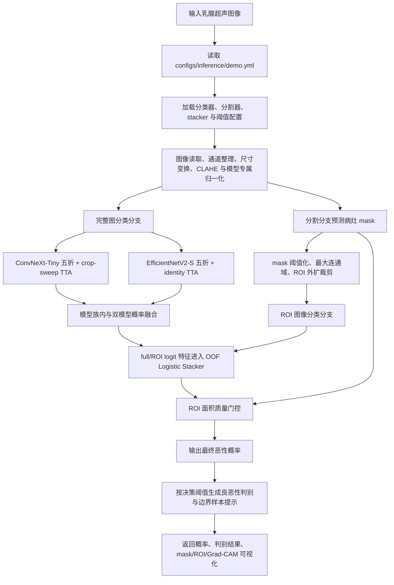
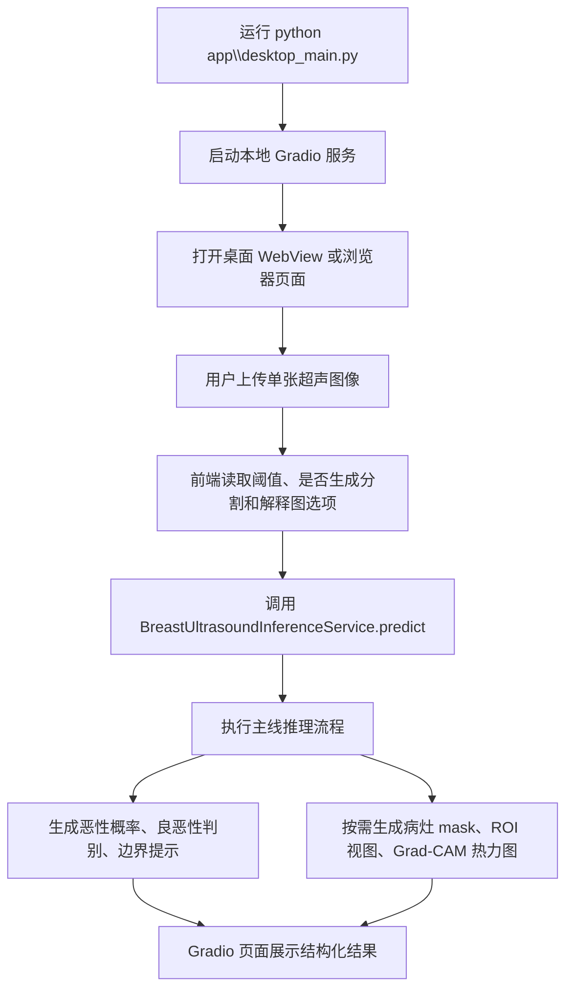
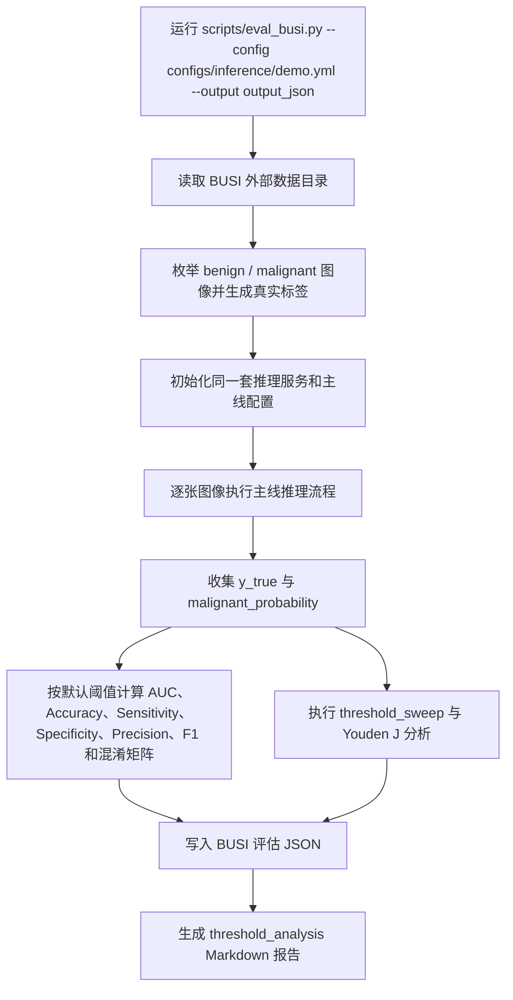

# BUCAD

[English README](README_EN.md)

BUCAD（Breast Ultrasound Computer-Aided Diagnosis）是一个面向乳腺超声影像良恶性辅助分析的计算机辅助诊断研究原型系统。系统集成深度学习分类、语义分割、ROI 引导推理、Grad-CAM 可解释性可视化、本地 Gradio 推理界面以及 Windows 桌面部署方案。

项目围绕“可复现实验”和“可运行演示”两个目标组织：一方面保留训练、外部验证、OOF 融合、ROI 消融和失败候选的实验记录，另一方面提供可直接启动的本地演示程序。当前 README 主要描述已验证的稳定主线和围绕该主线形成的实验依据，不把探索性分支等同于默认部署行为。

本项目用于算法验证、可复现实验、教学演示及受控的二次开发，尚未经过临床注册和多中心临床验证，不能作为独立临床诊断依据。所有输出应理解为算法研究结果，而不是临床诊断结论。

## 数据与验证

- BUSBRA 用于模型训练、内部验证、out-of-fold 候选筛选和阈值选择。
- 项目实验对比统一报告 AUC、Accuracy、Recall/Sensitivity、Precision、Specificity 和 F1-Score。

项目采用“内部选择、外部复核”的实验边界。BUSBRA 内部划分采用病例级分组策略，记录中共有 1875 张图像、1064 个唯一病例、5 个 fold，泄漏检测结果为 false。BUSI 作为外部数据集，用于记录主线与候选配置在独立来源上的迁移表现。

该边界对本项目较为关键。乳腺超声图像存在设备、采集角度、病灶大小、背景组织和标注风格差异，仅依赖内部 OOF 提升容易高估泛化能力。因此 README 中区分三类结果：已部署主线、冻结外部验证通过但未合入的候选、内部提升但 BUSI 迁移不足的失败实验。

## 当前主线配置

当前可复现推理配置位于 `configs/inference/demo.yml`。


| 组件         | 模型                | 算法                                      | 权重  | 说明                                               |
| ------------ | ------------------- | ----------------------------------------- | ----- | -------------------------------------------------- |
| 主分类分支   | ConvNeXt-Tiny       | ConvNeXt (Liu et al., 2022)               | 0.573 | 五折 checkpoint，timm-aware 预处理，crop-sweep TTA |
| 辅助分类分支 | EfficientNetV2-S    | EfficientNetV2 (Tan & Le, 2021)           | 0.427 | 五折 checkpoint，CLAHE 预处理，identity TTA        |
| 分割分支     | UNet-ResNet18       | U-Net decoder + ResNet-18 encoder          | —    | 运行时分割器，256 输入，输出二值病灶 mask           |
| 融合层       | Logistic Stacker    | Logistic Regression (sklearn)             | —    | 基于 BUSBRA OOF 训练，使用 logit 空间特征          |

主线推理流程按“完整图分类 → 分割 ROI 裁剪 → ROI 分类 → logit 空间融合 → ROI 质量门控 → 阈值化判别 → 可解释性输出”执行。完整图分支保留全局组织背景和采集上下文；ROI 分支聚焦病灶区域及其周边组织；stacker 在 BUSBRA OOF 上学习两类视图的校准关系；ROI 面积门控在 mask 过小或过大时回退到完整图预测，降低错误 ROI 对最终概率的负面影响。

该配置没有采用简单多数投票或后验人工调权。ConvNeXt-Tiny 与 EfficientNetV2-S 的权重来自内部 OOF 证据，ROI/full 分支融合使用 logit 特征而非原始概率，分类阈值和 ROI gate 均在 BUSBRA 内部确定。

### 关键技术参数


| 参数             | 值           | 选定依据                                                                    |
| ---------------- | ------------ | --------------------------------------------------------------------------- |
| 分割 mask 阈值   | 0.40         | BUSBRA Dice 扫描：0.30→0.7971,**0.40→0.8085**, 0.50→0.8074, 0.60→0.7797 |
| ROI 边界扩展系数 | 0.35         | 保留病灶周边组织上下文的折中设置                                            |
| ROI 面积门控     | [0.08, 0.75] | 超出范围回退至完整图预测，由 BUSBRA OOF 协议选定                            |
| 分类阈值         | 0.510        | 当前冻结推理配置的默认运行阈值                                              |
| 边界样本标记     | ±0.08       | 预测概率距阈值 ±0.08 内标记为不确定                                        |

补充说明：

- ConvNeXt-Tiny 分支使用 5 个 fold checkpoint，每个成员权重为 0.573，采用 CLAHE、timm mean/std、bicubic 插值、`crop_pct=0.95` 和 6 视图 crop-sweep TTA。
- EfficientNetV2-S 分支使用 5 个 fold checkpoint，每个成员权重为 0.427，采用 CLAHE、224 输入、area 插值和 identity TTA。该分支主要提供与 ConvNeXt 不同的结构归纳偏置和恶性召回倾向。
- UNet-ResNet18 分割分支使用运行时 checkpoint `segmenter_fold1.pt`。
- ROI stacker 使用 logit 空间特征，系数为 `[2.1359, 0.9337]`，截距为 `-0.8671`。
- `borderline_margin=0.08` 只用于界面层面的边界样本提示，不参与 AUC 计算，也不改变排序指标。

### BUSI 外部验证结果


| 配置                      |  阈值 |    AUC | Accuracy | Sensitivity | Specificity | Precision | F1-Score |
| ------------------------- | ----: | -----: | -------: | ----------: | ----------: | --------: | -------: |
| 完整主线（UNet-ResNet18 ROI Area Gate） | 0.510 | 0.9256 |   0.8532 |      0.8667 |      0.8467 |    0.7309 |   0.7930 |

混淆矩阵：TN 370 / FP 67 / FN 28 / TP 182。

该结果来自 `artifacts/reports/busi_demo_current_external.json`。报告内 threshold analysis 的 Youden J 最优点同为 `0.51`，README 以当前 `demo.yml` 的默认阈值为准。

## 系统运行流程

### 主线推理流程



1. 输入图像先进入统一的推理服务，服务读取 `configs/inference/demo.yml` 中的模型权重、预处理、ROI 和阈值配置。
2. 完整图分支保留全局组织背景，分别经过 ConvNeXt-Tiny 和 EfficientNetV2-S 五折分类器得到 full-view 恶性概率。
3. 分割分支生成病灶 mask，经阈值化、最大连通域和边界扩展后裁剪 ROI，再由同一分类器体系评估 ROI-view 恶性概率。
4. full-view 与 ROI-view 概率转换到 logit 空间后进入 OOF Logistic Stacker，得到融合概率。
5. ROI 面积质量门控检查 mask 是否过小或过大；若 ROI 证据异常，则回退到完整图概率。
6. 最终概率与当前决策阈值比较，生成良恶性判别、边界样本提示、病灶 mask、ROI 裁剪和 Grad-CAM 可解释性输出。

### Demo 演示流程



1. `app\desktop_main.py` 负责启动本地 Gradio 推理服务，并在桌面窗口或浏览器中打开界面。
2. 用户上传单张图像后，界面将图像、当前阈值、分割开关和可解释性开关传入推理服务。
3. 推理服务执行完整主线流程，返回恶性概率、阈值化判别结果和边界样本提示。
4. 若启用分割和解释输出，界面同步展示病灶 mask、ROI 裁剪图和 Grad-CAM 热力图。
5. Demo 流程面向单图交互，不生成批量指标；主要用于演示模型推理、ROI 证据和可解释性结果。

### Benchmark 测试流程



1. Benchmark 入口为 `scripts\eval_busi.py`，命令行指定推理配置和输出 JSON 路径。
2. 脚本读取 BUSI 数据目录，按类别目录生成样本列表与真实标签。
3. 每张图像复用与 Demo 相同的推理服务和 `configs/inference/demo.yml` 配置，得到恶性概率。
4. 脚本汇总全部样本的真实标签和预测概率，计算固定阈值下的分类指标与混淆矩阵。
5. 同时执行阈值扫描和 Youden J 分析，输出 `threshold_analysis` 结果。
6. 最终产物包括 BUSI 评估 JSON、阈值分析 Markdown 和可用于 README/报告引用的指标表。

## 预处理流程

### 图像读取与输入规范化

乳腺超声原始图像通常包含灰度病灶区域、设备文字、黑边、测量标记和不同尺寸的画幅。项目在进入模型前统一完成图像读取、通道整理、尺寸变换和模型专属归一化。灰度图会被整理为模型可接受的三通道输入；分类模型采用 224 输入，分割模型采用 256 输入；不同模型分支保留各自的插值、crop 和归一化参数，避免为了统一接口而破坏预训练模型的输入分布。

### CLAHE 对比度增强

超声图像普遍存在局部对比度低、散斑噪声强、病灶边缘模糊等问题。系统在配置启用的分支中应用 Contrast Limited Adaptive Histogram Equalization（CLAHE），通过局部直方图均衡增强病灶边界、内部回声及周围组织的对比度差异，为后续 CNN 特征提取提供更稳定的灰度结构。

CLAHE 的作用不是简单提高亮度，而是限制局部直方图均衡的对比度放大幅度，使低对比度病灶边界和内部回声结构更容易被卷积特征捕获，同时降低散斑噪声被过度增强的风险。对于乳腺超声任务，这类灰度结构增强比大幅颜色扰动、强几何变换更符合医学图像的成像特点。

### 模型专属归一化

不同模型家族因 ImageNet 预训练配置不同，推理时必须保持预处理一致性。系统采用 timm-aware 策略，使 mean/std、插值方式和 crop 比例与预训练配方保持一致：


| 模型             | mean                  | std                   | 插值    | crop_pct |
| ---------------- | --------------------- | --------------------- | ------- | -------- |
| ConvNeXt-Tiny    | [0.485, 0.456, 0.406] | [0.229, 0.224, 0.225] | bicubic | 0.95     |
| EfficientNetV2-S | [0.485, 0.456, 0.406] | [0.229, 0.224, 0.225] | area    | 默认     |

模型专属归一化的核心是保持“训练时看到的图像分布”和“推理时输入分布”一致。ConvNeXt 分支严格对齐 timm 预训练 recipe；EfficientNet 分支采用更保守的 identity 视图和 area 插值，以降低推理延迟和多视图增强带来的不稳定性。

### timm-aware 预处理的必要性

timm-aware 预处理是 ConvNeXt 系列模型有效迁移预训练权重的前提条件。在项目系统测试过的早期非 timm-aware 配方下，ConvNeXt-Tiny 在 BUSI 上 AUC 仅为 0.5996（Sensitivity=0，近似随机）。引入 timm-aware 配方后 AUC 提升至 0.8943（+0.2947）。Swin-Tiny 同样受益，非 timm 配方 AUC 0.8242，timm 配方提升至 0.8729（+0.0487）。

详细消融数据见 `artifacts/reports/Chinese reports/01_baseline_model_screening/native_single_model_retest.md`。

## 优化技术与消融实验

本节按照“先建立模型上限，再逐步加入稳定增益”的顺序记录主线优化。所有实验均遵守 BUSBRA 内部选择、BUSI 冻结外部复核的边界。只有当外部 AUC 提升且 Sensitivity、Specificity、Precision、F1-Score 等关键指标没有明显回退时，候选才具备进入主线的条件。

项目没有把所有看似先进的结构都纳入默认 demo。对于医学影像小样本任务，复杂模型、更多 checkpoint、额外 TTA 或元学习器都可能提高内部 OOF，却在外部数据上下降。因此 README 同时记录“有效优化”和“拒绝原因”，便于复现实验选择过程。

当前主线实际采用的优化技术包括：病例级五折交叉验证集成、ConvNeXt 分支 crop-sweep TTA、UNet-ResNet18 预测 mask 引导的 ROI 分支、最大连通域后处理、ROI 面积质量门控、BUSBRA OOF Logistic Stacking，以及基于 ConvNeXt-Tiny 与 EfficientNetV2-S 的双模型互补集成。这些模块分别对应模型方差控制、输入视角增强、病灶区域聚焦、分割噪声抑制、异常 ROI 回退、概率校准和结构互补。

以下消融实验用于说明每项优化技术对内部验证、外部复核和固定阈值指标的具体影响。表格中的候选不等同于默认部署行为，只有经过整体指标权衡后保留下来的模块才进入 `configs/inference/demo.yml`。

### 1. 五折交叉验证集成

采用病例级分组的 StratifiedGroupKFold 划分方案，确保同一患者样本不跨折出现。推理阶段先在同一模型族内汇总五折输出，再进入后续模型融合。

五折策略主要解决两个问题：第一，单折训练受病例划分影响较大，医学影像样本量有限时容易出现 fold 偶然性；第二，多个 fold checkpoint 在推理阶段形成轻量 ensemble，可降低单个模型对局部数据分布的过拟合。项目在 ConvNeXt-Tiny、EfficientNetV2-S、DenseNet-121 和 Swin-Tiny 上均观察到五折外部 AUC 高于单折，说明该策略对不同模型家族具有一致收益。

**消融结果（BUSBRA 5-fold CV AUC）：**


| 模型             | Fold1 单折 | 5-fold 均值 | 标准差 | 说明   |
| ---------------- | ---------: | ----------: | -----: | ------ |
| ConvNeXt-Tiny V1 |     0.9259 |      0.9212 | 0.0196 | —     |
| ConvNeXt-Tiny V2 |     0.9278 |      0.9176 | 0.0107 | 更稳定 |
| ConvNeXt-Small   |     0.9118 |      0.9162 | 0.0163 | —     |
| EfficientNetV2-S |     0.9248 |      0.8946 | 0.0241 | —     |

**BUSI 外部消融（5-fold vs 单折）：**


| 模型             | 单折 AUC | 5-fold AUC |    提升 |
| ---------------- | -------: | ---------: | ------: |
| ConvNeXt-Tiny    |   0.8943 |     0.9054 | +0.0111 |
| EfficientNetV2-S |   0.8609 |     0.8997 | +0.0388 |
| DenseNet-121     |   0.8766 |     0.8914 | +0.0148 |
| Swin-Tiny        |   0.8729 |     0.8971 | +0.0242 |

从外部验证看，EfficientNetV2-S 的五折收益最大（+0.0388），说明该模型单折波动较强；ConvNeXt-Tiny 的单折已经较稳，但五折仍带来 +0.0111 AUC。该结果支持主线使用“五折模型族内平均”作为基础，而不是只选择某一个表现较好的 fold。

详细数据见 `artifacts/reports/Chinese reports/01_baseline_model_screening/fivefold_single_model_comparison.md`。

### 2. Crop-Sweep 测试时增强

乳腺超声图像中病灶尺寸、位置及周围组织背景差异显著。单一 center crop 可能因裁剪过紧丢失病灶周围组织信息，或因裁剪过松引入过多无关背景。

ConvNeXt 分支采用三种 crop 比例（0.90、0.95、1.00），每种配合水平翻转，共生成六个推理视图。多视图预测结果取平均，以降低单一裁剪尺度造成的偶然偏差。

该 TTA 设计只用于 ConvNeXt 分支，而没有直接扩展到所有模型。原因是 ConvNeXt 对 crop 视图变化的收益更稳定，EfficientNetV2-S 若增加多视图推理会显著增加延迟，但内部收益不足。项目在推理成本和外部收益之间做了保守取舍：将 TTA 预算集中到最能带来稳定增益的主分类分支。

**消融结果（ConvNeXt-Tiny 5-fold，BUSI 外部）：**


| TTA 策略         |        AUC | Sensitivity | Specificity |   F1-Score |
| ---------------- | ---------: | ----------: | ----------: | ---------: |
| identity（基线） |     0.8991 |      0.7381 |      0.8810 |     0.7434 |
| + 水平翻转       |     0.9041 |          — |      0.8924 |     0.7524 |
| + crop-sweep     | **0.9054** |  **0.7714** |      0.8719 | **0.7696** |
| + 旋转 ±5°     |     0.9048 |          — |  **0.8970** |         — |

crop-sweep 在 AUC（+0.0063）、Sensitivity（+0.0333）和 F1（+0.0262）上均为最优。

旋转 ±5° 在部分阈值点提高 Specificity，但没有超过 crop-sweep 的综合收益。考虑到超声探头角度和病灶方向本身具有临床意义，过强旋转也可能改变局部纹理和形态表达，因此默认主线采用 crop-sweep，而不使用旋转 TTA。

详细数据见 `artifacts/reports/Chinese reports/04_tta_threshold_external_eval/convnext_tta_optimization.md`。

### 3. ROI 分割引导

完整图分类器接收整张超声图像，可能同时包含黑边、设备标注、探头区域及正常组织纹理等非病灶信息。ROI 分支通过 UNet-ResNet18 分割模型预测病灶 mask，经最大连通域提取和边界扩展裁剪后生成 ROI 图像，再由分类模型评估局部病灶视角下的恶性概率。

ROI 分支不是为了替代完整图分支，而是补充病灶局部观察。完整图保留采集背景和周围组织上下文，ROI 图减少非病灶区域干扰；两者经过 stacker 融合后，可以在不同样本上动态平衡全局视角和局部视角。为了避免“使用 GT mask 得到不可部署上界”的问题，正式候选选择只使用预测 mask，Oracle ROI 仅作为理论对照。

分割器相关优化集中在可部署的 mask 后处理、ROI 几何约束和下游 ROI 标定上，而不是把人工真值 mask 作为推理输入。具体包括：在 BUSBRA 分割验证中扫描 mask 阈值，选择稳定的 `0.40`；对预测 mask 提取最大连通域，抑制散点和设备标注附近的伪阳性区域；在裁剪时加入 `margin_ratio=0.35`，保留病灶周边组织和声学阴影等上下文；再通过 logit stacker 和面积门控控制 ROI 证据进入最终概率的方式。

**分割与 ROI 后处理依据：**


| 分割/ROI 处理  | 内部依据                        | 下游影响                                                |
| -------------- | ------------------------------- | ------------------------------------------------------- |
| mask 阈值 0.30 | BUSBRA Dice 0.7971，ROI 偏大    | 容易引入较多背景区域                                    |
| mask 阈值 0.40 | BUSBRA Dice**0.8085**，本组最高 | 作为默认 mask 二值化阈值                                |
| mask 阈值 0.50 | BUSBRA Dice 0.8074，接近 0.40   | Dice 略低，弱边界保留更少                               |
| mask 阈值 0.60 | BUSBRA Dice 0.7797              | 阈值偏高，可能切掉低回声边界                            |
| 最大连通域 LCC | 降低碎片化 mask 干扰            | BUSI AUC 0.9196 → 0.9208，Sensitivity 0.8429 → 0.8524 |
| ROI 外扩 0.35  | 保留 perilesional context       | 避免裁剪过紧导致形态和周边组织信息缺失                  |

**消融结果（BUSI 外部）：**


| 配置                  |    AUC | Sensitivity | 说明                   |
| --------------------- | -----: | ----------: | ---------------------- |
| 完整图基线            | 0.9151 |          — | 双模型集成，无 ROI     |
| + Segmenter ROI       | 0.9196 |      0.8429 | +0.0045                |
| + LCC 后处理          | 0.9208 |      0.8524 | +0.0057 vs 基线        |
| Oracle ROI（GT mask） | 0.9202 |          — | 理论上界对照，不可部署 |

ROI 引导在 AUC 上带来 +0.0057 的稳定提升。最大连通域（LCC）后处理通过抑制碎片化 mask 进一步提升 AUC +0.0012、Sensitivity +0.0095。后续更强分割结构与重新标定实验没有超过当前面积门控主线，说明下游分类收益仍受 ROI 分布和 stacker 校准共同约束，不能只由分割 Dice 判断。

该结果说明，ROI 的收益来自可部署的预测 mask，而不是借助人工标注 mask 的信息泄漏。Oracle ROI 没有显著高于预测 ROI，也提示当前分类性能瓶颈不完全由分割重叠度决定，而与 ROI 裁剪尺度、分类器视角和概率校准共同相关。

详细数据见 `artifacts/reports/Chinese reports/02_roi_segmentation/roi_oof_experiment.md`、`artifacts/reports/Chinese reports/02_roi_segmentation/roi_oof_lcc_optimization.md` 和 `artifacts/reports/Chinese reports/08_segmenter_recalibrated_roi/segmenter_recalibrated_roi_all_methods_summary.md`。

### 4. ROI 面积质量门控

分割预测并非始终可靠。面积过小（< 0.08）可能表示分割器仅捕获噪声区域；面积过大（> 0.75）可能表示 ROI 裁剪已经接近完整图或包含过多非病灶区域。面积门控在 ROI 质量异常时回退至完整图预测。

面积门控的设计来自错误样本分析：部分良性样本被 ROI 裁剪后失去周围组织信息，概率被局部纹理误导；部分分割 mask 只覆盖很小区域或几乎覆盖全图，说明 ROI 本身不再可信。面积门控用一个可解释、可复现的规则识别这些异常情况，在 ROI 证据不足时让完整图分支接管。

**消融结果（BUSI 外部）：**


| 配置                |         AUC | Sensitivity | Specificity |   Precision |    F1-Score |      FP |     FN |
| ------------------- | ----------: | ----------: | ----------: | ----------: | ----------: | ------: | -----: |
| ROI OOF LCC（基线） |      0.9208 |      0.8524 |      0.8169 |      0.6911 |      0.7633 |      80 |     31 |
| 当前面积门控配置    |  **0.9256** |  **0.8667** |  **0.8467** |  **0.7309** |  **0.7930** |      67 |     28 |

在 UNet-ResNet18 ROI 消融中，面积门控是唯一同时提升全部六项指标的技术。被拒绝的替代方案包括：仅调阈值（增益过小）、移除 LCC（AUC/Sensitivity 回退）、门控 < 0.25（AUC -0.0116）。当前主线保留该面积质量门控配置作为默认 demo 的 ROI 防护机制。

面积门控的关键收益在于识别异常 ROI 并回退到完整图分支。对于良恶性辅助诊断任务，这比单独移动阈值更有价值，因为门控改变的是分支选择和证据来源，而不是只改变判别点。

详细数据见 `artifacts/reports/Chinese reports/02_roi_segmentation/roi_precision_f1_study.md`。

### 5. OOF Logistic Stacking

不同模型、TTA 视图和 ROI/完整图分支的概率分布存在校准差异，直接平均可能放大某一分支的系统性偏差。系统采用 BUSBRA 训练集 out-of-fold 预测训练 Logistic Regression 融合器，以 logit 空间特征作为输入，避免直接依赖外部验证集搜索权重。

使用 OOF 训练 stacker 的原因是避免同一训练样本既参与基模型拟合，又被用于训练融合器。每个样本的 OOF 概率都来自未见过该样本的 fold 模型，更接近真实推理分布。logit 空间融合比概率空间更适合线性模型，因为概率在接近 0 或 1 时会被压缩，直接线性组合容易损失校准信息。

**消融结果（BUSI 外部）：**


| 融合方式              | BUSI AUC | 说明                   |
| --------------------- | -------: | ---------------------- |
| 静态加权平均          |   0.9130 | eff 0.427 / conv 0.573 |
| OOF Logistic Stacking |   0.9138 | +0.0008，多视图输入    |

OOF stacking 在内部验证中提供了更规范的融合器训练口径，但外部 AUC 提升有限（+0.0008）。其主要价值在于通过内部 OOF 预测学习分支权重与校准关系，而不是在外部验证集上手动调参。

因此，stacking 在项目中的定位是“规范融合流程”和“支持 ROI/full 概率校准”，不是单独追求大幅 AUC 提升的模块。它与 ROI 面积门控结合后，才能形成完整的 ROI-aware 推理路径。

详细数据见 `artifacts/reports/Chinese reports/03_ensemble_oof_stacking/oof_two_model_stacking.md`。

### 6. 集成成员选择

项目对多个候选模型进行了系统筛选。以下为单折（fold1）代表性外部复核结果；ConvNeXt、Swin、DenseNet 和 EfficientNet 等预训练分类器采用 timm-aware 配方，YOLO26x-cls 为独立旁路实验：

模型选择不是按单一 AUC 排序直接决定。项目同时考虑以下因素：外部 AUC、Sensitivity/Specificity 平衡、Precision/F1、内部验证稳定性、五折收益、推理成本、checkpoint 数量、与其他模型的错误互补性，以及是否容易在小样本下过拟合。最终主线选择 ConvNeXt-Tiny 与 EfficientNetV2-S，是因为两者在结构归纳偏置和错误模式上具有互补性：ConvNeXt-Tiny 负责较强的总体排序能力，EfficientNetV2-S 提供不同 CNN 族的补充视角。


| 模型              | 参数量 |    AUC | Sensitivity | Specificity | F1-Score |
| ----------------- | -----: | -----: | ----------: | ----------: | -------: |
| ConvNeXt-Tiny     |    28M | 0.8943 |      0.7762 |      0.8741 |   0.7617 |
| ConvNeXt-Small    |    50M | 0.8947 |      0.7667 |      0.8581 |   0.7436 |
| Swin-Tiny         |    28M | 0.8729 |      0.7048 |      0.8902 |   0.7291 |
| DenseNet-121      |     8M | 0.8766 |      0.4571 |      0.9771 |   0.6076 |
| EfficientNetV2-S  |    21M | 0.8609 |      0.8333 |      0.7048 |   0.6809 |
| ResNet-18         |    11M | 0.8480 |      0.7714 |      0.8124 |   0.7137 |
| MobileNetV3-Small |   2.5M | 0.8431 |      0.7143 |      0.7735 |   0.6536 |
| YOLO26x-cls       |    28M | 0.8189 |      0.6571 |      0.8650 |   0.6781 |
| Basic CNN         |     — | 0.7327 |      0.0429 |      0.9794 |   0.0789 |
| VGG-16            |   138M | 0.5000 |      0.0000 |      1.0000 |   0.0000 |

表中可以看到，参数量并不直接决定性能。VGG-16 参数量最大但迁移失败；Basic CNN 特异性很高但几乎不能识别恶性样本；DenseNet-121 Precision/Specificity 较高但 Sensitivity 明显不足；EfficientNetV2-S 单折 Sensitivity 较高但 Specificity 偏低。YOLO26x-cls 作为通用分类权重的旁路复核，BUSBRA fold1 val AUC 为 0.8216、BUSI 外部 AUC 为 0.8189，未达到既有 ConvNeXt/Swin/DenseNet 单折水平。ConvNeXt-Tiny 的优势在于综合指标更均衡，并且在修正 timm-aware 预处理后从早期失败状态显著恢复。

**双模型 vs 三模型集成（BUSI 外部正式评估）：**


| 配置                              |         AUC | Sensitivity | Specificity |   Accuracy |    F1-Score |
| --------------------------------- | ----------: | ----------: | ----------: | ---------: | ----------: |
| 双模型（ConvNeXt + EfficientNet） |      0.9142 |      0.7524 |      0.9130 |     0.8609 |      0.7783 |
| 三模型（+ DenseNet）              |      0.9144 |      0.7095 |      0.9382 |     0.8640 |      0.7720 |
| **差异**                          | **+0.0002** | **-0.0429** | **+0.0252** | **+0.031** | **-0.0063** |

三模型 AUC 仅高 0.0002，但 Sensitivity 下降 4.3%，部署复杂度增加（15 vs 10 个 checkpoint）。双模型在 Youden 最优点的 Accuracy 更高（0.8655 vs 0.8516），因此主线选择双模型。

这一选择体现了项目的合并原则：AUC 的微小提升不足以抵消恶性召回下降和部署复杂度增加。对于比赛 demo 和医学影像辅助诊断场景，模型结构需要在性能、稳定性和可解释的工程复杂度之间平衡。

详细数据见 `artifacts/reports/Chinese reports/03_ensemble_oof_stacking/formal_best_ensemble_external_eval.md`。

### 7. ConvNeXt-Small 升级评估

ConvNeXt-Small（50M 参数）在单折外部 AUC 上略高于 ConvNeXt-Tiny（28M 参数），但内部验证 AUC 反而更低，且训练损失接近 0，提示当前配置下存在过拟合风险。

ConvNeXt-Small 是合理的升级候选，但还不是可以直接进入默认配置的合并项。它的外部单折 AUC 高 0.0038，但内部 fold1 AUC 低 0.0141，Youden J 几乎相同。这种“外部单点略高、内部稳定性不足”的组合不满足主线合并标准。若后续继续研究该方向，应先完成更严格的五折训练、正则化和 OOF 迁移验证，而不是仅凭单折 BUSI AUC 改动默认模型。

**消融结果：**


| 模型           | BUSBRA fold1 AUC | BUSI fold1 AUC |    Youden J |
| -------------- | ---------------: | -------------: | ----------: |
| ConvNeXt-Tiny  |           0.9259 |         0.8953 |      0.6671 |
| ConvNeXt-Small |           0.9118 |         0.8991 |      0.6665 |
| **差异**       |      **-0.0141** |    **+0.0038** | **-0.0006** |

内部 AUC 下降 0.0141 与外部 AUC 提升 0.0038 的矛盾表明 ConvNeXt-Small 在当前训练配置下泛化不稳定。Youden J 几乎相同（0.6671 vs 0.6665），未达到主线合并标准。

详细数据见 `artifacts/reports/Chinese reports/01_baseline_model_screening/convnext_small_upgrade_experiment.md`。

### 8. 阈值选择与指标权衡

项目同时报告 AUC 和固定阈值指标。AUC 反映排序能力，不依赖某一个阈值；Sensitivity、Specificity、Precision 和 F1-Score 则反映实际判别点的临床含义。当前主线阈值 `0.510` 与 `configs/inference/demo.yml` 保持一致，默认演示界面采用该冻结配置阈值。

阈值调优曾作为独立方向测试，但单纯移动阈值只能改变 FP/FN 的分布，不能改善概率排序质量。ROI 面积门控能够同时提升 AUC 和固定阈值指标，说明它改变的是输入分支选择和概率质量，而不是只做后验阈值偏移。

### 9. 可解释性输出

系统保留 Grad-CAM 和病灶 mask 可视化，用于展示分类模型关注区域与分割 ROI 的关系。可解释性输出不参与训练或调参，主要服务于 demo 展示、错误样本复核和人工审阅。对于误判样本，Grad-CAM 可帮助区分模型是否关注病灶本体、周围组织、图像黑边或设备标注，从而辅助后续错误类型归因。

## 已测试但未采纳的方案


| 方案                      | BUSBRA OOF 表现  | BUSI 外部表现 | 拒绝原因                                                                 |
| ------------------------- | ---------------- | ------------- | ------------------------------------------------------------------------ |
| Model-Zoo OOF 候选        | AUC 0.9352       | AUC 0.9213    | 内部 OOF 大幅提升但外部 AUC 与 Sensitivity 下降，存在 OOF 过拟合         |
| 困难样本 Focal 重训练     | fold1 AUC 0.9051 | 未进入 BUSI   | 过度聚焦困难样本，排序质量低于原始 ConvNeXt fold1                        |
| 温和困难样本重训练        | fold1 AUC 0.9086 | 未进入 BUSI   | 样本权重降低 AUC，未达到完整五折训练标准                                 |
| 面积感知动态权重          | AUC 0.9232       | AUC 0.9185    | 未超过主线 0.9208                                                        |
| OOF Meta-Learner          | AUC 0.9241       | AUC 0.9115    | 外部 AUC 回退 0.0093                                                     |
| ROI 软门控 + 多尺度裁剪   | AUC 0.9221       | AUC 0.9189    | 外部 AUC 低于当前主线                                                    |
| ROI 面积门控 OOF 协议     | AUC 0.9233       | —            | 候选配置未超过主线                                                       |
| 非 0.40 mask 阈值         | Dice 低于 0.8085 | 未进入主线    | 0.40 在 BUSBRA 分割验证中 Dice 最高，低阈值 ROI 过大，高阈值易损失弱边界 |
| 去掉最大连通域 LCC        | —               | AUC 0.9196    | 低于 LCC 后处理后的 AUC 0.9208，Sensitivity 也回退                       |
| ConvNeXt seed 多样性      | AUC 0.9249       | AUC 0.9250    | 外部 AUC 略低于主线，Sensitivity 下降                                    |
| Weight Soup (seed 42+123) | AUC 0.9232       | AUC 0.9225    | 权重平均降低运行时开销，但 AUC 和 F1 均下降                              |
| 轻度正则化重训练          | fold1 AUC 0.9096 | 未进入 BUSI   | AUC 与原始 fold1 差距过大                                                |
| CutMix / Mixup            | fold1 AUC 0.9145 | 未进入 BUSI   | Specificity 提升但排序质量和 Sensitivity 下降                            |
| 320 输入分辨率            | fold1 AUC 0.9210 | 未进入 BUSI   | 显存开销增加，Sensitivity 下降，未超过原始 fold1                         |
| EfficientNet TTA          | AUC 0.9190       | 未进入 BUSI   | 内部增益过小且增加推理延迟                                               |
| YOLO26x-cls 单折分类      | AUC 0.8216       | AUC 0.8189    | 作为旁路分类候选未超过既有 ConvNeXt/Swin/DenseNet 单折基线               |

详细记录见 `artifacts/reports/Chinese reports/` 下各分类子目录中的对应协议文件。

这些失败实验的共同特征是：内部 OOF 或单折指标可以局部改善，但外部验证没有形成稳定收益。项目因此采用较严格的合并条件，避免把复杂但不可迁移的方案写入默认 demo。该策略也解释了为什么主线保持相对克制：在 BUSI 外部复核中，简单、稳定、可解释的 ROI area gate 比更复杂的后验融合更可靠。

## 完整管线配置演进

以下为主线相关技术从基线到当前冻结配置的 BUSI 外部 AUC 演进，表中标明当前 `demo.yml` 实际部署点。


| 阶段                        | 配置              |   BUSI AUC |     说明 |
| --------------------------- | ----------------- | ---------: | -----------: |
| 单折 ConvNeXt-Tiny          | fold1, identity   |     0.8943 |         基线 |
| + timm-aware 配方           | 修正预处理失配    |     0.8943 |     前提条件 |
| + 五折集成                  | 5-fold average    |     0.9054 |      +0.0111 |
| + crop-sweep TTA            | 3 crop × hflip   |     0.9054 | 包含在五折中 |
| + EfficientNetV2-S 辅助分支 | 双模型静态加权    |     0.9130 |      +0.0076 |
| + OOF Logistic Stacking     | logit 融合        |     0.9138 |      +0.0008 |
| + ROI 分割引导              | UNet + LCC        |     0.9208 |      +0.0070 |
| + 面积质量门控              | [0.08, 0.75] 回退 | **0.9256** | **当前主线** |

该演进路径反映了主线优化的实际来源。最大增益来自 timm-aware 预处理修正、五折集成、双模型互补和 ROI area gate；OOF stacking 的单独 AUC 增益较小，但提供了更规范的融合训练方式；ROI 分割引导的收益依赖后处理、质量门控和 stacker 标定，不能只看分割 Dice。当前 `demo.yml` 采用 UNet-ResNet18 ROI 与 [0.08, 0.75] 面积质量门控，对应外部 AUC 0.9256、默认阈值 0.51 的稳定主线。

从工程角度看，最终主线没有追求“模型数量越多越好”，而是把每个新增模块都要求落到可解释的误差改善上。面积门控能减少 FP 和 FN，crop-sweep 能提升 ConvNeXt 的外部 AUC 与 F1，五折集成能降低单折波动，这些都是可以通过消融表直接验证的收益。

## 指标定义


| 指标                 | 定义                              | 临床意义                       |
| -------------------- | --------------------------------- | ------------------------------ |
| AUC                  | ROC 曲线下面积                    | 模型区分良恶性的整体排序能力   |
| Accuracy             | (TP+TN) / (TP+TN+FP+FN)           | 整体预测正确率                 |
| Sensitivity (Recall) | TP / (TP+FN)                      | 恶性检出率，反映漏诊风险       |
| Specificity          | TN / (TN+FP)                      | 良性正确识别率，反映误诊控制   |
| Precision            | TP / (TP+FP)                      | 阳性预测可靠性                 |
| F1-Score             | 2PR / (P+R)                       | Precision 与 Recall 的调和均值 |
| Youden J             | Sensitivity + Specificity - 1     | 综合评估阈值优劣               |
| Dice                 | 2 * overlap / (area(A) + area(B)) | 分割 mask 与 GT 的重叠度       |

## 项目结构

```
BUCAD/
├── configs/                          # 配置文件
│   ├── classifier/                   # 分类器训练配置
│   ├── segmenter/                    # 分割器训练配置
│   └── inference/                    # 推理与集成配置
├── src/
│   ├── datasets/                     # 数据集加载与划分
│   ├── models/                       # 模型工厂（分类器/分割器）
│   ├── engine/                       # 训练/评估/推理引擎
│   ├── explain/                      # Grad-CAM 可解释性
│   ├── preprocess/                   # 图像预处理与 ROI 裁剪
│   └── utils/                        # 配置/指标/报告/日志
├── scripts/                          # 命令行入口脚本
├── app/                              # Gradio Web 应用
├── packaging/                        # Windows 桌面打包配置
├── tests/                            # 单元/集成/smoke 测试
└── artifacts/
    ├── checkpoints/                  # 模型权重（通过 Git LFS 或本地资产管理）
    └── reports/                      # 实验报告与评估结果
        ├── Chinese reports/          # 中文实验报告（按实验主题分类，190 份）
        ├── English reports/          # 英文实验报告（按实验主题分类，140 份）
        └── README.md                 # 报告目录分类说明
```

`artifacts/reports/Chinese reports/` 和 `artifacts/reports/English reports/` 按实验主题分类保存报告，便于从模型筛选、ROI 分割、OOF 融合、TTA/阈值、错误分析、demo 发布等方向追溯证据。默认 README 只列出主线相关的关键报告；更细的失败实验和旁路候选保留在对应子目录中。

`artifacts/checkpoints/` 中的 `.pt` 权重由 Git LFS 管理。队友首次 clone 后如果发现权重文件只有几 KB，通常说明尚未下载 LFS 实体，需要执行 `git lfs pull`。默认演示程序依赖 ConvNeXt-Tiny 五折、EfficientNetV2-S 五折和 `segmenter_fold1.pt` 分割器 checkpoint。

## 运行方式

### 环境配置

首次拉取项目后，先安装依赖并确认 Git LFS 模型权重已经完整下载：

```powershell
git lfs install
git lfs pull

conda create -n BUCAD python=3.11 -y
conda activate BUCAD
python -m pip install -r requirements.txt
```

`configs/inference/demo.yml` 引用的主线演示权重位于 `artifacts/checkpoints/`，包括 ConvNeXt-Tiny 五折、EfficientNetV2-S 五折，以及 `segmenter_fold1.pt`。安装 Git LFS 后，正常 `git clone` 通常会自动拉取这些 `.pt` 文件；如果 `.pt` 文件只有几 KB，说明本地拿到的是 pointer 文件，需要执行 `git lfs pull`。

项目主要运行环境为 `BUCAD` conda 环境。Windows 本地演示只需要推理依赖；训练和批量评估还需要 CUDA、PyTorch、timm、segmentation_models_pytorch、scikit-learn、OpenCV、pandas、PyYAML、tqdm、Gradio 和 Grad-CAM 相关依赖。若只运行 demo，优先确认以下三项：

1. `conda activate BUCAD` 能正常进入环境。
2. `python check_env.py` 能识别 PyTorch、OpenCV、timm 等主要依赖。
3. `artifacts/checkpoints/` 中的 `.pt` 文件为实际权重文件，而不是 Git LFS pointer。

训练或批量评估需要本地数据集路径。复制 `configs/paths.example.yml` 为 `configs/paths.local.yml`，并按实际位置配置：

```yaml
datasets:
  busbra_root: ./训练集/BUSBRA
  busi_root: ./测试集/Dataset_BUSI_with_GT
```

### 运行演示程序

```powershell
conda activate BUCAD
python app\desktop_main.py
```

桌面演示程序默认读取 `configs/inference/demo.yml`。该配置已经冻结为 ConvNeXt-Tiny + EfficientNetV2-S + ROI Area Gate 主线，可直接用于单图上传和可解释性展示。演示程序的主要输出包括恶性概率、阈值化判别结果、边界样本提示、病灶 mask、ROI 裁剪区域和 Grad-CAM 热力图。若分割或可解释性图像生成失败，推理服务允许在配置范围内回退，不影响基础分类概率输出。

若只需要浏览器界面，也可以运行：

```powershell
conda activate BUCAD
python app\main.py
```

### 运行测试程序

```powershell
conda activate BUCAD
python check_env.py
python check_all.py
```

`check_env.py` 用于检查 Python、CUDA、PyTorch 和主要依赖；`check_all.py` 用于执行项目级环境与基础功能检查。完成上述检查后，`python app\desktop_main.py` 应可在本地启动演示界面。

开发或合并代码前建议运行单元测试：

```powershell
conda activate BUCAD
python -m pytest tests/unit -q
```

单元测试覆盖指标计算、ROI 推理、descriptor 特征、分割模块和基础数值稳定性。它不能替代 BUSI 外部验证，但可以在提交前发现接口、shape 和基础逻辑错误。

### Windows 打包

```powershell
python -m PyInstaller --clean --noconfirm packaging\desktop_demo.spec
```

输出：`dist/bucad-demo-desktop/bucad-demo-desktop.exe`。需分发完整目录。

### 训练与评估

```powershell
# 生成数据划分
python scripts\make_split.py --config configs\paths.local.yml

# 训练分类器（单折）
python scripts\train_cls.py --config configs\classifier\convnext_tiny_timm_recipe.yml --fold 1

# 批量评估
python scripts\eval_busi.py --config configs\inference\demo.yml --output artifacts\reports\busi_demo.json
```

`scripts/eval_busi.py` 是 BUSI 外部复核的统一入口，输出 JSON 中包含固定阈值 metrics 和 threshold_analysis。候选方案完成内部配置后，可用该脚本生成外部复核结果。

## 硬件要求


| 项目     | 推理/演示           | 训练/实验              |
| -------- | ------------------- | ---------------------- |
| 操作系统 | Windows 10/11 x64   | Windows 10/11 x64      |
| Python   | 打包后无需安装      | Conda + 3.11           |
| GPU      | 非必需              | NVIDIA CUDA，8GB+ VRAM |
| 内存     | 8GB 最低，16GB 推荐 | 16GB 最低，32GB 推荐   |
| 磁盘     | 8GB                 | 50GB                   |

## 关键实验报告索引


| 报告                                                               | 内容                                 |
| ------------------------------------------------------------------ | ------------------------------------ |
| `01_baseline_model_screening/native_single_model_retest.md`        | timm-aware vs 非 timm-aware 配方对比 |
| `01_baseline_model_screening/fivefold_single_model_comparison.md`  | 四模型 5-fold vs 单折对比            |
| `04_tta_threshold_external_eval/convnext_tta_optimization.md`      | ConvNeXt TTA 策略消融                |
| `02_roi_segmentation/roi_oof_experiment.md`                        | ROI 引导 vs 完整图对比               |
| `02_roi_segmentation/roi_oof_lcc_optimization.md`                  | LCC 后处理消融                       |
| `02_roi_segmentation/roi_precision_f1_study.md`                    | ROI 面积门控消融                     |
| `08_segmenter_recalibrated_roi/segmenter_recalibrated_roi_all_methods_summary.md` | 分割器替换与 ROI 重新标定对比        |
| `03_ensemble_oof_stacking/oof_two_model_stacking.md`               | OOF Stacking vs 静态权重             |
| `03_ensemble_oof_stacking/formal_best_ensemble_external_eval.md`   | 双模型 vs 三模型正式评估             |
| `01_baseline_model_screening/convnext_small_upgrade_experiment.md` | ConvNeXt-Small vs Tiny 对比          |
| `01_baseline_model_screening/yolo_cls_yolo26x-cls_fold1.md`        | YOLO26x-cls fold1 旁路分类对比       |
| `01_baseline_model_screening/six_model_comparison_report.md`       | 六模型全面对比（BUSBRA + BUSI）      |

完整报告目录见 `artifacts/reports/Chinese reports/`，分类说明见 `artifacts/reports/README.md`。

## 参考文献

- Al-Dhabyani W, et al. Dataset of breast ultrasound images. *Data in Brief*, 2020. [[PubMed]](https://pubmed.ncbi.nlm.nih.gov/31867417/)
- Liu Z, et al. A ConvNet for the 2020s. *CVPR*, 2022.
- Tan M, Le Q. EfficientNetV2: Smaller models and faster training. *ICML*, 2021.
- Ronneberger O, et al. U-Net: Convolutional networks for biomedical image segmentation. *MICCAI*, 2015.
- He K, et al. Deep residual learning for image recognition. *CVPR*, 2016.
- ROI-aware breast ultrasound classification. [[PMC11431713]](https://pmc.ncbi.nlm.nih.gov/articles/PMC11431713/)
- Multi-task breast ultrasound segmentation and classification. [[PMC12011763]](https://pmc.ncbi.nlm.nih.gov/articles/PMC12011763/)
- OpenUS ultrasound foundation model. [[GitHub]](https://github.com/XZheng0427/OpenUS)
- BUSI segmentation reference. [[GitHub]](https://github.com/tqxli/breast_ultrasound_lesion_segmentation_PyTorch)
- BUSI-SAM / BUSSAM segmentation references. [[GitHub]](https://github.com/huangjin520/BUSI-SAM) [[GitHub]](https://github.com/bscs12/BUSSAM)

## 许可

本项目仅供科研、教学与比赛复现实验使用。
