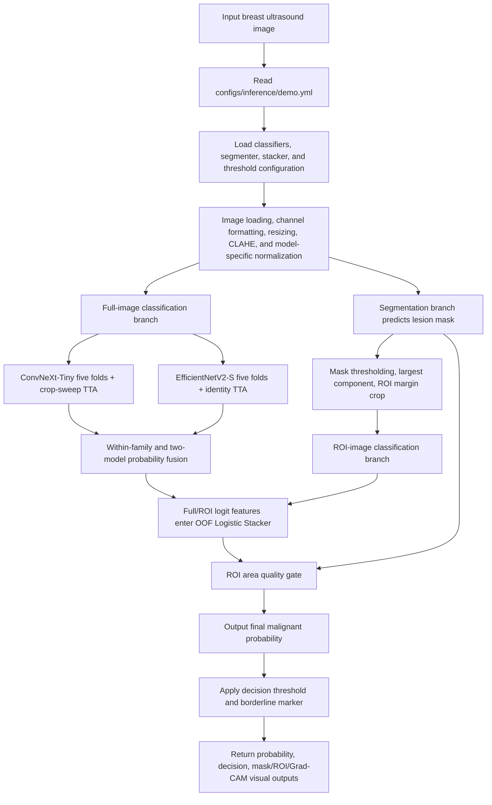
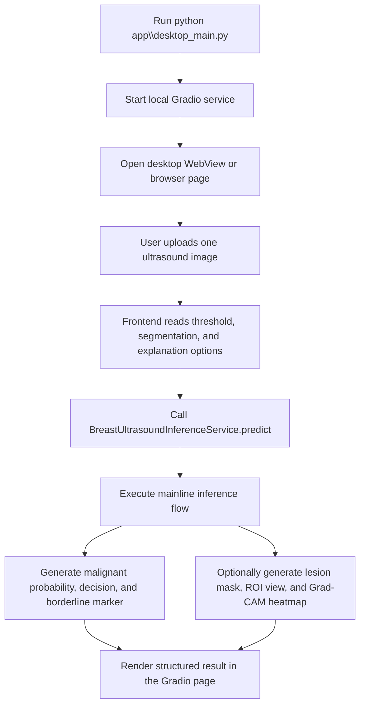
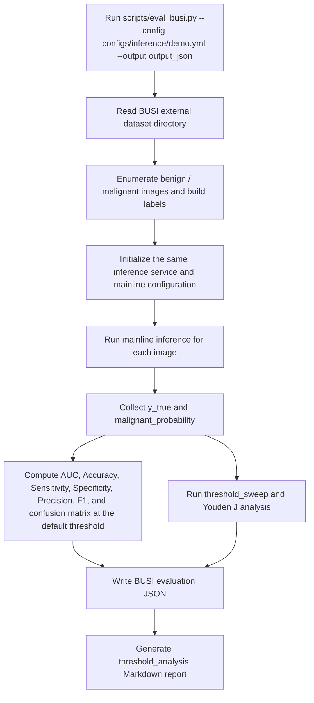

# BUCAD

[Chinese README](README.md)

BUCAD (Breast Ultrasound Computer-Aided Diagnosis) is a computer-aided diagnosis research prototype for benign/malignant analysis of breast ultrasound images. The system integrates deep-learning classification, semantic segmentation, ROI-guided inference, Grad-CAM explainability visualization, a local Gradio inference interface, and Windows desktop deployment.

The project is organized around two practical goals: reproducible experimentation and a runnable local demonstration. It keeps training records, external validation results, out-of-fold fusion evidence, ROI ablations, and rejected candidate protocols, while also providing a desktop demo that can be started directly after the environment and checkpoints are available. This README describes the validated stable mainline and the experimental evidence around it; exploratory branches are not treated as default deployment behavior.

The project is intended for algorithm validation, reproducible experimentation, teaching demonstrations, and controlled secondary development. It has not undergone clinical registration or multi-center clinical validation and must not be used as an independent clinical diagnosis basis. All outputs should be interpreted as algorithm research results, not clinical diagnosis conclusions.

## Data and Validation Protocol

- BUSBRA is used for model training, internal validation, out-of-fold candidate screening, and threshold selection.
- Project experiment tables report AUC, Accuracy, Recall/Sensitivity, Precision, Specificity, and F1-Score.

The project follows an "internal selection, external review" boundary. The BUSBRA internal split uses case-level grouping; the recorded split contains 1875 images, 1064 unique cases, 5 folds, and leakage detection result `false`. BUSI is used as an external dataset to record transfer behavior of the mainline and candidate configurations on an independent source.

This boundary is important for breast ultrasound. Images differ in device characteristics, acquisition angle, lesion scale, background tissue, and annotation style. Internal OOF gains can overestimate transferability if they are not checked externally. The README therefore separates three categories: deployed mainline, frozen candidates reviewed externally but not merged, and internal-gain experiments that did not transfer to BUSI.

## Latest LesioNeXt Performance and Innovation

LesioNeXt-LENS v1a is frozen as the current paper model. Training uses BUSBRA BBOX annotations for lesion evidence alignment, while deployment loads one ConvNeXt-Tiny-derived classifier and uses global pooled features for the final logits. The five-fold training configuration is [`configs/classifier/lesionext_lens_v1a_evidence_only.yml`](configs/classifier/lesionext_lens_v1a_evidence_only.yml), and the locked external inference configuration is [`configs/inference/lesionext_lens_v1a_5fold_identity.yml`](configs/inference/lesionext_lens_v1a_5fold_identity.yml).

The latest strict single-factor ablation compares v1a training-time BBOX evidence alignment with a no-alignment control. Backbone, evidence head, deployment alpha, split, augmentation, seed, and training rule are identical; the only change sets alignment weight from `0.25` to `0.00`. The no-alignment control reached BUSBRA fold-1 AUC `0.9358`, Sensitivity `0.7705`, and F1 `0.7966`, exceeding v1a values of `0.9298`, `0.7295`, and `0.7911`; v1a retained higher Accuracy `0.8747` and Specificity `0.9447`. v1a raised BBOX evidence mass to `0.9873`, compared with `0.2987` without alignment, confirming effective weak localization supervision. This single-fold control does not yet support a stable classification-gain claim for evidence alignment. The five-fold stage retains this ablation and all external cohorts remain frozen. See the [`Chinese report`](artifacts/reports/lesionext_lens_v1a_no_alignment_control_fold1_zh.md) and [`English report`](artifacts/reports/lesionext_lens_v1a_no_alignment_control_fold1_en.md).

The preregistered v1a five-fold run is complete. Pooled BUSBRA OOF reached AUC `0.9150`, Accuracy `0.8709`, Sensitivity `0.7694`, Specificity `0.9196`, Precision `0.8207`, and F1 `0.7942`. Against ConvNeXt-Tiny identity OOF, AUC/Accuracy/Specificity/Precision/F1 increase by `0.0144`, `0.0208`, `0.0332`, `0.0552`, and `0.0243`; Sensitivity is lower by `0.0049`. The preregistered Sensitivity threshold is `0.7743`, so the current result cannot support a complete-superiority claim over ConvNeXt-Tiny. The four external datasets remain frozen. Full reports: [`Chinese`](artifacts/reports/lesionext_lens_v1a_5fold_oof_zh.md) and [`English`](artifacts/reports/lesionext_lens_v1a_5fold_oof_en.md).

This run also fixes checkpoint-path resolution in the OOF evaluator and adds a missing-checkpoint fail-fast guard. The reported OOF was rerun after the correction, preventing randomly initialized models from entering the aggregate metric.

Five-fold v1a AUC is `0.9089` / `0.8847` / `0.8171` / `0.8617` on BUSI / BUS-UCLM / BUSI-WHU / TCIA BrEaST. The paper must retain its internal Sensitivity delta of `-0.0049` and the no-alignment ablation limitation. See the [`Chinese external report`](artifacts/reports/lesionext_lens_v1a_v3_external_review_zh.md) and [`English external report`](artifacts/reports/lesionext_lens_v1a_v3_external_review_en.md).

The complete all-model, all-dataset metric table is available across BUSBRA pooled OOF, BUSI, BUS-UCLM, BUSI-WHU, and TCIA BrEaST. LesioNeXt-MoE V3 remains a historical comparison row; LesioNeXt-LENS v1a is the current paper method. The table includes AUC, Accuracy, Sensitivity, Specificity, Precision, F1, and external AUC 95% CIs. See the [`Chinese full table`](artifacts/reports/fixed_classification_benchmark/all_model_comparison_v1a_zh.md), [`English full table`](artifacts/reports/fixed_classification_benchmark/all_model_comparison_v1a_en.md), and [`CSV`](artifacts/reports/fixed_classification_benchmark/all_model_comparison_v1a.csv).

`LENS v1b Sensitivity Rank` completed its one-factor BUSBRA fold-1 screening. The v1a architecture, BBOX alignment, split, augmentation, and deployment path remained fixed; only `pairwise_auc_weight: 0.02` and `pairwise_auc_margin: 0.05` were added. v1b reached AUC `0.9262`, Accuracy `0.8587`, Sensitivity `0.7213`, Specificity `0.9249`, Precision `0.8224`, and F1 `0.7686`, below the corresponding v1a results. v1b is stopped and will not receive five-fold expansion. External cohorts were not read.

LesioNeXt candidates that failed promotion or were superseded by v1a are archived in [`artifacts/reports/lesionext_archive/README.md`](artifacts/reports/lesionext_archive/README.md), including checkpoint, configuration, and report copies plus an archive manifest. Original working files remain available for audit.

### Archived: LesioNeXt-LENS v1

| Dataset | LENS AUC | ConvNeXt-Tiny control AUC | Delta | Status |
|---|---:|---:|---:|---|
| BUSBRA fold 1 | **0.9267** | 0.9141 | +0.0126 | Internal AUC gate passed |
| BUSI fold 1 | **0.9091** | 0.8531 | +0.0560 | Single-fold locked review |
| BUS-UCLM fold 1 | **0.8625** | 0.8492 | +0.0133 | Single-fold locked review |
| BUSI-WHU fold 1 | **0.7671** | 0.7294 | +0.0377 | Single-fold locked review |
| TCIA BrEaST fold 1 | **0.8390** | 0.7830 | +0.0560 | Single-fold locked review |
| BUSBRA 5-fold OOF | 0.8907 | **0.9006** | -0.0099 | Internal five-fold did not exceed control |
| BUSI 5-fold external | **0.9098** | 0.8991 | +0.0107 | Higher LENS AUC |
| BUS-UCLM 5-fold external | 0.8939 | **0.8946** | -0.0007 | Near tie |
| BUSI-WHU 5-fold external | **0.8050** | 0.7966 | +0.0084 | Higher LENS AUC |
| TCIA BrEaST 5-fold external | **0.8495** | 0.8382 | +0.0113 | Higher LENS AUC |

LENS defines its main contribution as **lesion evidence alignment**: BUSBRA BBOX annotations supervise a lesion evidence map during training, and the classifier uses evidence-weighted pooling. Deployment loads one ConvNeXt-Tiny-derived model, with no BBOX input, teacher, segmenter, or fusion model. The five-fold external review showed higher LENS AUC on three of four datasets and higher sensitivity on all four datasets, while Accuracy and Specificity receded consistently and all AUC 95% CIs overlapped. The result supports an exploratory high-sensitivity cross-domain candidate; the fixed seven-model paper protocol remains the criterion for the main table. See [`artifacts/reports/lesionext_lens_v1_5fold_external_comparison_en.md`](artifacts/reports/lesionext_lens_v1_5fold_external_comparison_en.md) and [`configs/classifier/lesionext_lens_v1.yml`](configs/classifier/lesionext_lens_v1.yml).

LENS v2 changes only the global shared `evidence_alpha` into a per-image Evidence-Confidence Gate driven by evidence concentration and local/global embedding agreement. The implementation adds one parameter. Fold-1 AUC reached `0.9238`, above the `0.9191` AUC gate; Accuracy `0.8133` and Sensitivity `0.5082` missed the release criteria, while Specificity rose to `0.9605`. Diagnostics show alpha increased from `0.0206` in v1 to `0.1961 ± 0.0134`, confirming that the gate entered the decision path. This version became overly conservative with a high-specificity bias, so five-fold and external evaluation were stopped. See [`artifacts/reports/lesionext_lens_v2_confidence_fold1_screening_en.md`](artifacts/reports/lesionext_lens_v2_confidence_fold1_screening_en.md).

| Version | BUSBRA Fold-1 AUC | Accuracy | BUSI AUC | BUSI-WHU AUC | Status |
|---|---:|---:|---:|---:|---|
| LesioNeXt-MoE V3 | 0.9057* | - | - | - | Stable historical control |
| LesioNeXt-LENS v2 Confidence Gate | 0.9238 | 0.8133 | Not run | Not run | Gate learned; Accuracy and Sensitivity missed release gates |
| LesioNeXt-MoE V4.3 | 0.9117 | 0.8533 | 0.8786 | 0.7418 | Historical teacher-constrained candidate; not in the main table |
| LesioNeXt-AttnRes V4.4 | 0.9112 | 0.8427 | Not run | Not run | Did not pass the matched ConvNeXt-Tiny control; external screening stopped |
| LesioNeXt-AttnRes V4.5 | 0.9039 | 0.8107 | Not run | Not run | Gate warm-start did not improve AUC; external screening stopped |
| LesioNeXt-AttnRes V4.6 | 0.9056 | 0.8373 | Not run | Not run | State history plus content query produced selective attention but did not exceed the matched ConvNeXt-Tiny control |

`*` The V3 control is the current fixed-seed, 8-epoch screening run; the historical five-fold OOF AUC was `0.9030`.

### V4.3 Innovation Notes

- **Reliable teacher distillation**: EfficientNetV2-S and Swin-Tiny remain frozen and provide KL soft-target constraints only on training samples where both teachers are confident and agree.
- **Single-model deployment**: Teacher models are excluded from the inference graph; no EfficientNet/Swin posterior fusion probability is generated, and deployment contains one LesioNeXt student.
- **Cross-domain training constraint**: Teacher coverage is recorded per epoch while BUSBRA training and locked external review boundaries remain unchanged.
- **Experimental correction**: V4.3 fixes the initial teacher-loss path that was wrapped by `torch.no_grad()`, so teacher forward passes remain frozen while the distillation loss backpropagates into the student.

V4.3 did not show a stable external advantage on BUSI and BUSI-WHU, so five-fold expansion was not started. See the full ablation log at [`artifacts/reports/lesionext_teacher_ablation_en.md`](artifacts/reports/lesionext_teacher_ablation_en.md) and the training configuration at [`configs/classifier/lesionext_moe_v4_3.yml`](configs/classifier/lesionext_moe_v4_3.yml).

### V4.4 Block Attention Residual Screening

V4.4 contracts LesioNeXt into one ConvNeXt-Tiny classification backbone and removes ROI MoE, expert routing, stage gates, delta history, spectral gates, and teacher constraints. Its new component is a Block Attention Residual Adapter inside ConvNeXt stages 3 and 4, using RMSNorm keys, zero-initialized pseudo-queries, and softmax depth attention.

Under an exactly matched BUSBRA fold-1 seed, input, augmentation, optimizer, 30-epoch schedule, and best-AUC checkpoint protocol, V4.4 reached AUC `0.9112` against the ConvNeXt-Tiny control's `0.9141`; Accuracy was `0.8427` against `0.8587`. The learned residual gates remained between `-0.0019` and `0.0019`, while depth attention stayed close to uniform, so the adapter did not establish useful historical selection in this run. BUSI and BUSI-WHU were not evaluated under the locked protocol, and V4.4 is excluded from the paper main table. See [`artifacts/reports/lesionext_attnres_v4_4_screening_en.md`](artifacts/reports/lesionext_attnres_v4_4_screening_en.md) and [`configs/classifier/lesionext_attnres_v4_4.yml`](configs/classifier/lesionext_attnres_v4_4.yml).

V4.5 changed only the gate initialization to `0.05` so the depth-attention branch would receive gradients from the beginning. Its BUSBRA fold-1 AUC was `0.9039`, below both V4.4 and the ConvNeXt-Tiny control. The opened gates still produced near-uniform historical attention, so external testing and five-fold training were not started. See [`artifacts/reports/lesionext_attnres_v4_5_gate_warmstart_en.md`](artifacts/reports/lesionext_attnres_v4_5_gate_warmstart_en.md).

V4.6 restricts injection to stage 4 once every two blocks. It records same-scale block states as history, derives each query from the current block content, and uses bounded interpolation of historical context. Gates remained close to `0.05`; the two attention rows became selective (`[0.2354, 0.7646]` and `[0.1235, 0.3469, 0.5296]`). BUSBRA fold-1 AUC was `0.9056` and Accuracy was `0.8373`, still below the matched ConvNeXt-Tiny control (`0.9141` / `0.8587`). External testing and five-fold training were not started. See [`artifacts/reports/lesionext_attnres_v4_6_state_content_en.md`](artifacts/reports/lesionext_attnres_v4_6_state_content_en.md).

## Current Mainline Configuration

The current reproducible inference configuration is at `configs/inference/demo.yml`.

| Component | Model | Algorithm | Weight | Notes |
|---|---|---|---|---|
| Primary classifier | ConvNeXt-Tiny | ConvNeXt (Liu et al., 2022) | 0.573 | 5-fold checkpoints, timm-aware preprocessing, crop-sweep TTA |
| Auxiliary classifier | EfficientNetV2-S | EfficientNetV2 (Tan & Le, 2021) | 0.427 | 5-fold checkpoints, CLAHE preprocessing, identity TTA |
| Segmenter | UNet-ResNet18 | U-Net decoder + ResNet-18 encoder | - | Runtime segmenter, 256 input, binary lesion mask output |
| Fusion layer | Logistic Stacker | Logistic Regression (sklearn) | - | Trained on BUSBRA OOF predictions, using logit-space features |

The mainline inference path is: full-image classification -> segmentation-based ROI crop -> ROI classification -> logit-space fusion -> ROI quality gate -> thresholded decision -> explainability output. The full-image branch preserves global tissue context and acquisition background. The ROI branch focuses on the lesion and perilesional tissue. The stacker learns calibration relationships between these two views from BUSBRA OOF predictions. The ROI area gate falls back to full-image prediction when the predicted mask is too small or too large, reducing the effect of unreliable ROI crops.

The configuration does not use simple majority voting or manual post-hoc weighting. ConvNeXt-Tiny and EfficientNetV2-S weights come from internal OOF evidence, ROI/full fusion uses logit features rather than raw probabilities, and the classification threshold and ROI gate are determined inside BUSBRA.

### Key Technical Parameters

| Parameter | Value | Selection Basis |
|---|---|---|
| Segmentation mask threshold | 0.40 | BUSBRA Dice sweep: 0.30->0.7971, **0.40->0.8085**, 0.50->0.8074, 0.60->0.7797 |
| ROI margin ratio | 0.35 | Compromise for preserving perilesional tissue context |
| ROI area gate | [0.08, 0.75] | Falls back to full-image prediction outside range; selected by BUSBRA OOF protocol |
| Classification threshold | 0.510 | Default operating threshold in the current frozen inference configuration |
| Borderline marking | +/-0.08 | Samples with predicted probability within +/-0.08 of threshold are marked as uncertain |

Additional notes:

- The ConvNeXt-Tiny branch uses 5 fold checkpoints. Each member has weight 0.573 and applies CLAHE, timm mean/std, bicubic interpolation, `crop_pct=0.95`, and 6-view crop-sweep TTA.
- The EfficientNetV2-S branch uses 5 fold checkpoints. Each member has weight 0.427 and applies CLAHE, 224 input, area interpolation, and identity-only TTA. This branch provides a different convolutional inductive bias and a complementary malignant-recall tendency.
- The UNet-ResNet18 segmenter uses runtime checkpoint `segmenter_fold1.pt`.
- The ROI stacker uses logit-space features with coefficients `[2.1359, 0.9337]` and intercept `-0.8671`.
- `borderline_margin=0.08` is only a user-interface caution marker for borderline samples. It does not participate in AUC computation and does not change ranking metrics.

### BUSI External Validation Result

| Configuration | Threshold | AUC | Accuracy | Sensitivity | Specificity | Precision | F1-Score |
|---|---:|---:|---:|---:|---:|---:|---:|
| Full mainline (UNet-ResNet18 ROI Area Gate) | 0.510 | 0.9256 | 0.8532 | 0.8667 | 0.8467 | 0.7309 | 0.7930 |

Confusion matrix: TN 370 / FP 67 / FN 28 / TP 182.

This result corresponds to the frozen `configs/inference/demo.yml` mainline configuration with a default threshold of `0.51`. Raw internal evaluation records are locally archived outside the project directory.

## System Runtime Flow

### Mainline Inference Flow



1. The input image enters the shared inference service, which reads model weights, preprocessing, ROI, and threshold settings from `configs/inference/demo.yml`.
2. The full-image branch preserves global tissue context and produces a full-view malignant probability through five-fold ConvNeXt-Tiny and EfficientNetV2-S classifiers.
3. The segmentation branch predicts a lesion mask; thresholding, largest connected component extraction, and margin expansion produce an ROI crop for ROI-view classification.
4. Full-view and ROI-view probabilities are converted into logit-space features and passed to the OOF Logistic Stacker.
5. The ROI area quality gate checks whether the predicted mask is too small or too large and falls back to full-image probability when ROI evidence is abnormal.
6. The final probability is compared with the active decision threshold to produce the benign/malignant decision, borderline marker, lesion mask, ROI crop, and Grad-CAM explanation.

### Demo Workflow



1. `app\desktop_main.py` starts the local Gradio inference service and opens the desktop or browser interface.
2. After a user uploads one image, the interface passes the image, active threshold, segmentation toggle, and explanation toggle to the inference service.
3. The service executes the full mainline flow and returns malignant probability, thresholded decision, and borderline status.
4. When visual outputs are enabled, the page also displays the lesion mask, ROI crop, and Grad-CAM heatmap.
5. The demo workflow is designed for single-image interaction and does not generate batch metrics.

### Benchmark Workflow



1. The benchmark entry point is `scripts\eval_busi.py`; the command specifies the inference config and output JSON path.
2. The script reads the BUSI dataset directory and builds a labeled sample list from benign and malignant folders.
3. Each image uses the same inference service and `configs/inference/demo.yml` configuration as the demo path.
4. The script collects true labels and malignant probabilities for all samples, then computes fixed-threshold classification metrics and the confusion matrix.
5. It also runs threshold sweep and Youden J analysis and stores the result under `threshold_analysis`.
6. Final artifacts include the BUSI evaluation JSON, threshold-analysis Markdown report, and metric tables used by README or formal reports.

## Preprocessing Pipeline

### Image Loading and Input Normalization

Raw breast ultrasound images often contain grayscale lesion regions, device text, black borders, measurement marks, and variable frame sizes. Before entering the models, the project standardizes image loading, channel formatting, resizing, and model-specific normalization. Grayscale images are converted to three-channel inputs accepted by the classifiers; classification models use 224 input size and the segmenter uses 256 input size. Each model branch keeps its own interpolation, crop, and normalization parameters instead of forcing a single preprocessing rule that would break the distribution expected by pretrained weights.

### CLAHE Contrast Enhancement

Ultrasound images commonly exhibit low local contrast, strong speckle noise, and blurred lesion edges. The system applies Contrast Limited Adaptive Histogram Equalization (CLAHE) in configured branches to enhance lesion boundaries, internal echogenicity, and surrounding tissue contrast differences, providing more stable gray-scale structure for subsequent CNN feature extraction.

CLAHE is not a simple brightness increase. It limits the amplification strength of local histogram equalization, making low-contrast lesion borders and internal echo patterns easier for convolutional features to capture while reducing the risk of over-amplifying speckle noise. For breast ultrasound, this type of gray-scale structural enhancement is more consistent with the imaging modality than strong color perturbations or aggressive geometric transforms.

### Model-Specific Normalization

Different model families require different preprocessing due to their ImageNet pretraining configurations. The system adopts a timm-aware strategy so that mean/std, interpolation method, and crop ratio remain aligned with the pretraining recipe:

| Model | mean | std | Interpolation | crop_pct |
|---|---|---|---|---|
| ConvNeXt-Tiny | [0.485, 0.456, 0.406] | [0.229, 0.224, 0.225] | bicubic | 0.95 |
| EfficientNetV2-S | [0.485, 0.456, 0.406] | [0.229, 0.224, 0.225] | area | default |

The purpose of model-specific normalization is to keep the input distribution at inference consistent with the distribution expected during pretraining and fine-tuning. The ConvNeXt branch is aligned with the timm pretrained recipe. The EfficientNet branch uses a more conservative identity view and area interpolation to reduce inference latency and avoid unstable gains from extra views.

### Necessity of Timm-Aware Preprocessing

Timm-aware preprocessing is a hard prerequisite for effective transfer of ConvNeXt-family pretrained weights. Under the early non-timm-aware recipe tested in this project, ConvNeXt-Tiny achieved AUC of only 0.5996 on BUSI (Sensitivity=0, near-random). After introducing the timm-aware recipe, AUC improved to 0.8943 (+0.2947). Swin-Tiny similarly benefited: non-timm AUC 0.8242, timm AUC 0.8729 (+0.0487).

Raw ablation records are locally archived and are not distributed with the repository.

## Optimization Techniques and Ablation Studies

This section records mainline optimization in the order of first establishing model capacity and then adding stable incremental gains. All experiments follow the BUSBRA internal-selection and BUSI frozen-review boundary. A candidate is eligible for the mainline only when external AUC improves and key fixed-threshold metrics such as Sensitivity, Specificity, Precision, and F1-Score do not materially regress.

The project does not merge every seemingly advanced structure into the default demo. In small-sample medical imaging, more complex models, more checkpoints, additional TTA, or meta-learners can improve internal OOF results while degrading external transfer. The README therefore records both effective optimizations and rejection reasons so that the experimental decision path is reproducible.

The current mainline adopts the following optimization techniques: case-level five-fold cross-validation ensemble, ConvNeXt crop-sweep TTA, a UNet-ResNet18 predicted-mask ROI branch, largest connected component post-processing, ROI area quality gate, BUSBRA OOF Logistic Stacking, and the complementary two-model ensemble of ConvNeXt-Tiny and EfficientNetV2-S. These modules address model variance control, input-view augmentation, lesion-region focusing, segmentation-noise suppression, abnormal-ROI fallback, probability calibration, and architectural complementarity.

The following ablation studies summarize how each optimization affects internal validation, external review, and fixed-threshold metrics. Candidate rows in these tables are not equivalent to default deployment behavior; only modules retained after overall metric review are included in `configs/inference/demo.yml`.

### 1. Five-Fold Cross-Validation Ensemble

StratifiedGroupKFold with case-level grouping is used to ensure that samples from the same patient do not appear across folds. During inference, outputs are first aggregated within each model family across five folds and then passed to the downstream fusion stage.

The five-fold strategy addresses two sources of instability. First, single-fold training is sensitive to case assignment when medical-image sample size is limited. Second, multiple fold checkpoints form a lightweight ensemble at inference time and reduce dependence on one local training split. ConvNeXt-Tiny, EfficientNetV2-S, DenseNet-121, and Swin-Tiny all showed higher external AUC after five-fold aggregation, indicating that the strategy is useful across different model families.

**Ablation results (BUSBRA 5-fold CV AUC):**

| Model | Fold1 Single | 5-fold Mean | Std | Note |
|---|---:|---:|---:|---|
| ConvNeXt-Tiny V1 | 0.9259 | 0.9212 | 0.0196 | - |
| ConvNeXt-Tiny V2 | 0.9278 | 0.9176 | 0.0107 | More stable |
| ConvNeXt-Small | 0.9118 | 0.9162 | 0.0163 | - |
| EfficientNetV2-S | 0.9248 | 0.8946 | 0.0241 | - |

**BUSI external ablation (5-fold vs single fold):**

| Model | Single Fold AUC | 5-fold AUC | Improvement |
|---|---:|---:|---:|
| ConvNeXt-Tiny | 0.8943 | 0.9054 | +0.0111 |
| EfficientNetV2-S | 0.8609 | 0.8997 | +0.0388 |
| DenseNet-121 | 0.8766 | 0.8914 | +0.0148 |
| Swin-Tiny | 0.8729 | 0.8971 | +0.0242 |

EfficientNetV2-S gains the most from five-fold aggregation (+0.0388), suggesting stronger single-fold variance. ConvNeXt-Tiny is already relatively stable as a single fold, but still gains +0.0111 AUC. This supports using within-family five-fold averaging as the base layer instead of selecting only one apparently strong fold.

Raw five-fold comparison records are locally archived and are not distributed with the repository.

### 2. Crop-Sweep Test-Time Augmentation

Lesion size, position, and surrounding tissue background vary significantly across breast ultrasound images. A single center crop may either lose perilesional tissue by cropping too tightly or introduce excessive irrelevant background by cropping too loosely.

The ConvNeXt branch uses three crop ratios (0.90, 0.95, 1.00), each with horizontal flipping, producing six inference views. Predictions are averaged across all views to reduce variance caused by any single crop scale.

This TTA design is applied to the ConvNeXt branch rather than all model families. ConvNeXt showed more stable benefit from crop-view variation. Extending multi-view inference to EfficientNetV2-S increases latency, while the internal gain was not strong enough to justify the cost. The deployment configuration therefore allocates TTA budget to the branch where it provides the clearest external benefit.

**Ablation results (ConvNeXt-Tiny 5-fold, BUSI external):**

| TTA Strategy | AUC | Sensitivity | Specificity | F1-Score |
|---|---:|---:|---:|---:|
| identity (baseline) | 0.8991 | 0.7381 | 0.8810 | 0.7434 |
| + horizontal flip | 0.9041 | - | 0.8924 | 0.7524 |
| + crop-sweep | **0.9054** | **0.7714** | 0.8719 | **0.7696** |
| + rotation +/-5 deg | 0.9048 | - | **0.8970** | - |

Crop-sweep achieves the best AUC (+0.0063), Sensitivity (+0.0333), and F1 (+0.0262) over identity baseline.

Rotation +/-5 degrees improves Specificity at some threshold points, but does not exceed the overall benefit of crop-sweep. Because probe angle and lesion orientation can carry clinical information, stronger rotation also risks changing local texture and shape expression. The default mainline therefore uses crop-sweep and excludes rotation TTA.

Raw TTA screening records are locally archived and are not distributed with the repository.

### 3. ROI Segmentation Guidance

Full-image classifiers receive the entire ultrasound frame, which may include borders, device annotations, probe regions, and normal tissue textures. The ROI branch uses a UNet-ResNet18 segmentation model to predict a lesion mask, then crops the ROI region after largest connected component extraction and margin expansion, and evaluates lesion-focused malignant probability with the classifier.

The ROI branch is not intended to displace the full-image branch. It provides a complementary local lesion view. The full image preserves acquisition context and surrounding tissue, while the ROI image suppresses non-lesion regions. After stacker fusion, the two views can be balanced per sample. To avoid the non-deployable upper bound caused by ground-truth masks, formal candidate selection uses predicted masks only; Oracle ROI is retained only as a theoretical control.

Segmenter-related optimization is focused on deployable mask post-processing, ROI geometry constraints, and downstream ROI calibration, not on using manual ground-truth masks as inference input. The project scans mask thresholds on BUSBRA segmentation validation and keeps the stable `0.40` setting. It then extracts the largest connected component from predicted masks to suppress fragmented regions and false positives near annotations or device marks. ROI cropping applies `margin_ratio=0.35` to retain perilesional tissue and acoustic-shadow context. The logit stacker and area gate then control how ROI evidence contributes to the final probability.

**Segmentation and ROI post-processing evidence:**

| Segmentation / ROI Processing | Internal Basis | Downstream Effect |
|---|---|---|
| Mask threshold 0.30 | BUSBRA Dice 0.7971, ROI tends to be large | More background can enter ROI crops |
| Mask threshold 0.40 | BUSBRA Dice **0.8085**, best in this sweep | Default mask binarization threshold |
| Mask threshold 0.50 | BUSBRA Dice 0.8074, close to 0.40 | Slightly lower Dice and less weak-boundary retention |
| Mask threshold 0.60 | BUSBRA Dice 0.7797 | Threshold too high, may remove low-echo borders |
| Largest connected component | Reduces fragmented-mask interference | BUSI AUC 0.9196 -> 0.9208, Sensitivity 0.8429 -> 0.8524 |
| ROI margin 0.35 | Preserves perilesional context | Avoids overly tight crops that lose morphology and surrounding tissue cues |

**Ablation results (BUSI external):**

| Configuration | AUC | Sensitivity | Note |
|---|---:|---:|---|
| Full-image baseline | 0.9151 | - | Dual-model ensemble, no ROI |
| + Segmenter ROI | 0.9196 | 0.8429 | +0.0045 |
| + LCC post-processing | 0.9208 | 0.8524 | +0.0057 vs baseline |
| Oracle ROI (GT mask) | 0.9202 | - | Theoretical upper-bound control, not deployable |

ROI guidance provides a stable +0.0057 AUC improvement. LCC post-processing further improves AUC by +0.0012 and Sensitivity by +0.0095 by suppressing fragmented masks. Later stronger-segmenter and recalibration experiments did not exceed the current area-gate mainline, showing that downstream classification gain is jointly constrained by ROI distribution and stacker calibration rather than segmentation Dice alone.

This result shows that ROI benefit comes from deployable predicted masks rather than information leakage from manual masks. Oracle ROI is not substantially higher than predicted ROI, which also suggests that the remaining classification bottleneck is not determined by segmentation overlap alone. ROI crop scale, classifier viewpoint, and probability calibration all contribute to downstream behavior.

Raw ROI screening records are locally archived and are not distributed with the repository.

### 4. ROI Area Quality Gate

Segmentation predictions are not always reliable. Area too small (< 0.08) may indicate the segmenter captured only noise. Area too large (> 0.75) may indicate that the crop is close to the full image or contains too much non-lesion background. The area gate falls back to full-image prediction when ROI quality is abnormal.

The area gate is motivated by error-case analysis. Some benign cases lose surrounding tissue context after ROI cropping and are pushed toward malignant probability by local texture. Some predicted masks cover only a tiny region or almost the whole frame, indicating that the ROI is no longer trustworthy. The gate uses an interpretable and reproducible rule to identify these cases and lets the full-image branch take over when ROI evidence is weak.

**Ablation results (BUSI external):**

| Configuration | AUC | Sensitivity | Specificity | Precision | F1-Score | FP | FN |
|---|---:|---:|---:|---:|---:|---:|---:|
| ROI OOF LCC (baseline) | 0.9208 | 0.8524 | 0.8169 | 0.6911 | 0.7633 | 80 | 31 |
| Current area-gate configuration | **0.9256** | **0.8667** | 0.8467 | **0.7309** | **0.7930** | 67 | 28 |

In the UNet-ResNet18 ROI ablation, the area gate is the only technique that simultaneously improves all six metrics. Rejected alternatives include threshold-only tuning (insufficient gain), removing LCC (AUC/Sensitivity regression), and gate < 0.25 (AUC -0.0116). The current mainline keeps this area-quality-gate configuration as the default demo ROI safeguard.

The key benefit of the area gate is identifying abnormal ROIs and falling back to the full-image branch. For benign/malignant auxiliary diagnosis, this is more valuable than moving only the threshold because it changes branch selection and evidence source rather than only the decision point.

Raw area-gate analysis records are locally archived and are not distributed with the repository.

### 5. OOF Logistic Stacking

Probability distributions differ across models, TTA views, and ROI/full-image branches; direct averaging can amplify systematic bias from one branch. The system trains a Logistic Regression fusion model on BUSBRA out-of-fold predictions, using logit-space features as input, avoiding direct weight search on the external validation set.

OOF training is used to prevent a sample from being used both to fit a base model and to train the fusion model on that model's in-sample prediction. Each OOF probability is produced by a fold model that did not see that sample during training, which better matches deployment behavior. Logit-space fusion is more suitable than direct probability-space linear mixing because probabilities are compressed near 0 and 1, while logits retain calibration information for the linear stacker.

**Ablation results (BUSI external):**

| Fusion Method | BUSI AUC | Note |
|---|---:|---|
| Static weighted average | 0.9130 | eff 0.427 / conv 0.573 |
| OOF Logistic Stacking | 0.9138 | +0.0008, multi-view input |

OOF stacking provides a more disciplined internal protocol for training a fusion model, but external AUC improvement is marginal (+0.0008). Its primary value is learning branch weights and calibration relationships from internal OOF predictions rather than manually tuning them on the external validation set.

In this project, stacking is therefore positioned as a disciplined fusion and calibration mechanism rather than a standalone large-AUC module. It becomes more useful when combined with ROI/full-view calibration and the ROI area gate.

Raw OOF fusion records are locally archived and are not distributed with the repository.

### 6. Ensemble Member Selection

The project systematically screened multiple candidate models. The following are representative single-fold (fold1) external review results; pretrained classifiers such as ConvNeXt, Swin, DenseNet, and EfficientNet use the timm-aware recipe, while YOLO26x-cls is an independent side experiment:

Model selection is not decided by AUC alone. The project considers external AUC, Sensitivity/Specificity balance, Precision/F1, internal validation stability, five-fold gain, inference cost, checkpoint count, complementarity of error patterns, and overfitting risk on a small dataset. The final mainline selects ConvNeXt-Tiny and EfficientNetV2-S because the two branches have complementary inductive biases: ConvNeXt-Tiny provides stronger overall ranking ability, while EfficientNetV2-S contributes a different CNN-family view and malignant-recall tendency.

| Model | Params | AUC | Sensitivity | Specificity | F1-Score |
|---|---:|---:|---:|---:|---:|
| ConvNeXt-Tiny | 28M | 0.8943 | 0.7762 | 0.8741 | 0.7617 |
| ConvNeXt-Small | 50M | 0.8947 | 0.7667 | 0.8581 | 0.7436 |
| Swin-Tiny | 28M | 0.8729 | 0.7048 | 0.8902 | 0.7291 |
| DenseNet-121 | 8M | 0.8766 | 0.4571 | 0.9771 | 0.6076 |
| EfficientNetV2-S | 21M | 0.8609 | 0.8333 | 0.7048 | 0.6809 |
| ResNet-18 | 11M | 0.8480 | 0.7714 | 0.8124 | 0.7137 |
| MobileNetV3-Small | 2.5M | 0.8431 | 0.7143 | 0.7735 | 0.6536 |
| YOLO26x-cls | 28M | 0.8189 | 0.6571 | 0.8650 | 0.6781 |
| Basic CNN | - | 0.7327 | 0.0429 | 0.9794 | 0.0789 |
| VGG-16 | 138M | 0.5000 | 0.0000 | 1.0000 | 0.0000 |

The table shows that parameter count does not directly determine performance. VGG-16 has the largest parameter count but fails to transfer. Basic CNN has high Specificity but almost cannot detect malignant samples. DenseNet-121 provides high Precision/Specificity but insufficient Sensitivity. EfficientNetV2-S has high single-fold Sensitivity but lower Specificity. As a side classification check, YOLO26x-cls reached BUSBRA fold1 val AUC 0.8216 and BUSI external AUC 0.8189, below the existing ConvNeXt/Swin/DenseNet single-fold baselines. ConvNeXt-Tiny is preferred because its metrics are more balanced and because its earlier failure was resolved after correcting the timm-aware preprocessing mismatch.

**Two-model vs three-model ensemble (BUSI formal external evaluation):**

| Configuration | AUC | Sensitivity | Specificity | Accuracy | F1-Score |
|---|---:|---:|---:|---:|---:|
| Two-model (ConvNeXt + EfficientNet) | 0.9142 | 0.7524 | 0.9130 | 0.8609 | 0.7783 |
| Three-model (+ DenseNet) | 0.9144 | 0.7095 | 0.9382 | 0.8640 | 0.7720 |
| **Difference** | **+0.0002** | **-0.0429** | **+0.0252** | **+0.031** | **-0.0063** |

Three-model AUC exceeds two-model by only 0.0002, but Sensitivity drops 4.3% with increased deployment complexity (15 vs 10 checkpoints). Two-model achieves higher Youden-optimal Accuracy (0.8655 vs 0.8516), so the mainline selects two models.

This reflects the project merge rule: a tiny AUC gain is not sufficient if malignant recall decreases and deployment complexity grows. For a competition demo and a medical-image auxiliary diagnosis workflow, model choice needs to balance performance, stability, and explainable engineering complexity.

Raw ensemble-screening records are locally archived and are not distributed with the repository.

### 7. ConvNeXt-Small Upgrade Evaluation

ConvNeXt-Small (50M params) shows marginally higher single-fold external AUC than ConvNeXt-Tiny (28M params), but lower internal AUC and training loss near zero, indicating overfitting risk under the current training recipe.

ConvNeXt-Small is a reasonable upgrade candidate, but it is not yet a default-configuration merge item. Its single-fold external AUC is higher by 0.0038, but internal fold1 AUC is lower by 0.0141 and Youden J is nearly identical. This combination of a small external single-point gain and weaker internal stability does not meet the mainline merge criterion. Further work on this direction should first complete stricter five-fold training, regularization, and OOF transfer validation.

**Ablation results:**

| Model | BUSBRA fold1 AUC | BUSI fold1 AUC | Youden J |
|---|---:|---:|---:|
| ConvNeXt-Tiny | 0.9259 | 0.8953 | 0.6671 |
| ConvNeXt-Small | 0.9118 | 0.8991 | 0.6665 |
| **Difference** | **-0.0141** | **+0.0038** | **-0.0006** |

The contradiction between internal AUC decrease (-0.0141) and external AUC increase (+0.0038) indicates unstable generalization under the current training configuration. Youden J is essentially identical (0.6671 vs 0.6665), not meeting the mainline merge criterion.

Raw upgrade-candidate records are locally archived and are not distributed with the repository.

### 8. Threshold Selection and Metric Trade-Offs

The project reports both AUC and fixed-threshold metrics. AUC reflects ranking ability and is independent of a specific threshold. Sensitivity, Specificity, Precision, and F1-Score describe the practical behavior at a decision point. The current mainline threshold `0.510` matches `configs/inference/demo.yml`, and the default demo interface follows this frozen configuration threshold.

Threshold tuning was tested as an independent direction, but moving only the threshold changes the FP/FN distribution without improving probability ranking quality. The ROI area gate improves both AUC and fixed-threshold metrics, indicating that it changes branch selection and probability quality rather than only applying a post-hoc threshold shift.

### 9. Explainability Output

The system retains Grad-CAM and lesion-mask visualization to show the relationship between classifier attention and segmentation ROI. Explainability output is not used for training or parameter tuning. It mainly supports demo presentation, error-case review, and manual inspection. For misclassified samples, Grad-CAM helps determine whether the model attends to the lesion itself, surrounding tissue, black borders, or device annotations, supporting later error-type attribution.

## Tested but Rejected Approaches

| Approach | BUSBRA OOF | BUSI External | Rejection Reason |
|---|---|---|---|
| Model-Zoo OOF candidates | AUC 0.9352 | AUC 0.9213 | Large internal OOF gain, but external AUC and Sensitivity decreased; likely OOF overfitting |
| Hard-sample focal retraining | fold1 AUC 0.9051 | Not sent to BUSI | Over-focused on difficult samples; ranking quality below original ConvNeXt fold1 |
| Mild hard-sample retraining | fold1 AUC 0.9086 | Not sent to BUSI | Sample weighting reduced AUC and did not meet five-fold training standard |
| Area-aware dynamic weights | AUC 0.9232 | AUC 0.9185 | Did not exceed mainline 0.9208 |
| OOF Meta-Learner | AUC 0.9241 | AUC 0.9115 | External AUC regression of 0.0093 |
| ROI soft gate + multi-scale | AUC 0.9221 | AUC 0.9189 | External AUC below current mainline |
| ROI area gate OOF protocol | AUC 0.9233 | - | Candidate did not exceed mainline |
| Non-0.40 mask thresholds | Dice below 0.8085 | Not merged | 0.40 has the best BUSBRA segmentation Dice; lower thresholds enlarge ROI, higher thresholds lose weak borders |
| Removing LCC | - | AUC 0.9196 | Below LCC post-processing AUC 0.9208, with Sensitivity regression |
| ConvNeXt seed diversity | AUC 0.9249 | AUC 0.9250 | External AUC slightly below mainline and Sensitivity decreased |
| Weight Soup (seed 42+123) | AUC 0.9232 | AUC 0.9225 | Weight averaging reduced runtime cost, but AUC and F1 decreased |
| Light regularization retraining | fold1 AUC 0.9096 | Not sent to BUSI | AUC too far below the original fold1 |
| CutMix / Mixup | fold1 AUC 0.9145 | Not sent to BUSI | Specificity improved, but ranking quality and Sensitivity decreased |
| 320 input resolution | fold1 AUC 0.9210 | Not sent to BUSI | Increased VRAM cost, Sensitivity decreased, and original fold1 was not exceeded |
| EfficientNet TTA | AUC 0.9190 | Not sent to BUSI | Internal gain was too small and inference latency increased |
| YOLO26x-cls single fold | AUC 0.8216 | AUC 0.8189 | Side classification candidate; did not exceed existing ConvNeXt/Swin/DenseNet single-fold baselines |

Complete internal protocols and rejected-candidate records are locally archived; the project directory retains only the runnable mainline.

These rejected experiments share a common pattern: internal OOF or single-fold metrics can improve locally, but the improvement does not transfer consistently to external validation. The project therefore uses strict merge conditions to avoid putting complex but non-transferable methods into the default demo. This also explains why the mainline remains conservative: in BUSI external review, a simple, stable, and interpretable ROI area gate was more reliable than more complicated post-hoc fusion schemes.

## Pipeline Configuration Evolution

The following shows BUSI external AUC evolution from baseline to the current frozen configuration and explicitly marks the actual deployment point in the current `demo.yml`.

| Stage | Configuration | BUSI AUC | Note |
|---|---|---:|---:|
| Single-fold ConvNeXt-Tiny | fold1, identity | 0.8943 | Baseline |
| + timm-aware recipe | Corrected preprocessing mismatch | 0.8943 | Prerequisite |
| + 5-fold ensemble | 5-fold average | 0.9054 | +0.0111 |
| + crop-sweep TTA | 3 crop x hflip | 0.9054 | Included in 5-fold |
| + EfficientNetV2-S auxiliary | Dual-model static weighting | 0.9130 | +0.0076 |
| + OOF Logistic Stacking | Logit fusion | 0.9138 | +0.0008 |
| + ROI segmentation guidance | UNet + LCC | 0.9208 | +0.0070 |
| + Area quality gate | [0.08, 0.75] fallback | **0.9256** | **Current mainline** |

This evolution path reflects the actual sources of mainline improvement. The largest gains come from correcting timm-aware preprocessing, five-fold aggregation, two-model complementarity, and the ROI area gate. OOF stacking has a small standalone AUC gain, but it provides a disciplined fusion protocol. ROI segmentation guidance depends on post-processing, quality gating, and stacker calibration, so downstream classification performance cannot be judged from Dice alone. The current `demo.yml` uses the UNet-ResNet18 ROI branch and [0.08, 0.75] area gate, corresponding to external AUC 0.9256 and default threshold 0.51.

From an engineering perspective, the final mainline does not assume that more models are always better. Each additional module is required to produce an interpretable error reduction. The area gate reduces both FP and FN, crop-sweep improves ConvNeXt external AUC and F1, and five-fold aggregation reduces fold variance; these benefits are directly traceable in the ablation tables.

## Metric Definitions

| Metric | Definition | Clinical Meaning |
|---|---|---|
| AUC | Area under ROC curve | Overall ranking ability for benign/malignant discrimination |
| Accuracy | (TP+TN) / (TP+TN+FP+FN) | Overall prediction correctness |
| Sensitivity (Recall) | TP / (TP+FN) | Malignant detection rate, reflects missed diagnosis risk |
| Specificity | TN / (TN+FP) | Benign correct identification rate, reflects false positive control |
| Precision | TP / (TP+FP) | Positive prediction reliability |
| F1-Score | 2PR / (P+R) | Harmonic mean of Precision and Recall |
| Youden J | Sensitivity + Specificity - 1 | Composite threshold quality assessment |
| Dice | 2 * overlap / (area(A) + area(B)) | Segmentation mask overlap with ground truth |

## Repository Layout

```
BUCAD/
├── configs/                          # Configuration files
│   ├── classifier/                   # Classifier training configs
│   ├── segmenter/                    # Segmenter training configs
│   └── inference/                    # Inference and ensemble configs
├── src/
│   ├── datasets/                     # Dataset loading and splits
│   ├── models/                       # Model factories (classifier/segmenter)
│   ├── engine/                       # Training/evaluation/inference engine
│   ├── explain/                      # Grad-CAM explainability
│   ├── preprocess/                   # Image preprocessing and ROI cropping
│   └── utils/                        # Config/metrics/reports/logging
├── scripts/                          # Command-line entry points
├── app/                              # Gradio web application
├── packaging/                        # Windows desktop packaging
├── tests/                            # Unit/integration/smoke tests
└── artifacts/
    ├── checkpoints/                  # Model weights (managed through Git LFS or local assets)
    └── reports/                      # Local runtime output, excluded from version control by default
```

Internal experiments, error-case material, and competition records are archived locally outside the project directory. The repository retains the frozen mainline configuration, inference code, model weights, and reproducible entry points.

`.pt` weights under `artifacts/checkpoints/` are managed through Git LFS. If checkpoint files are only a few KB after cloning the repository, the files are LFS pointers rather than real weights and `git lfs pull` is required. The default demo depends on the ConvNeXt-Tiny five-fold checkpoints, EfficientNetV2-S five-fold checkpoints, and `segmenter_fold1.pt` segmenter checkpoint.

## Running

### Environment Setup

After cloning the repository, install dependencies and ensure Git LFS checkpoints are hydrated:

```powershell
git lfs install
git lfs pull

conda create -n BUCAD python=3.11 -y
conda activate BUCAD
python -m pip install -r requirements.txt
```

The main demo weights referenced by `configs/inference/demo.yml` are stored under `artifacts/checkpoints/` through Git LFS. They include the 5-fold ConvNeXt-Tiny checkpoints, the 5-fold EfficientNetV2-S checkpoints, and `segmenter_fold1.pt`. A normal clone with Git LFS installed should download them automatically; if the `.pt` files are only a few KB, they are pointer files and `git lfs pull` is required.

The main runtime environment is the `BUCAD` conda environment. Windows local demo usage only requires inference dependencies; training and batch evaluation additionally require CUDA, PyTorch, timm, segmentation_models_pytorch, scikit-learn, OpenCV, pandas, PyYAML, tqdm, Gradio, and Grad-CAM dependencies. For demo-only use, first verify:

1. `conda activate BUCAD` enters the environment normally.
2. `python check_env.py` detects PyTorch, OpenCV, timm, and other major dependencies.
3. `.pt` files under `artifacts/checkpoints/` are real checkpoint files rather than Git LFS pointers.

Training or batch evaluation requires local dataset paths. Copy `configs/paths.example.yml` to `configs/paths.local.yml` and point to the actual dataset locations:

```yaml
datasets:
  busbra_root: ./训练集/BUSBRA
  busi_root: ./测试集/Dataset_BUSI_with_GT
```

### Run Demo Application

```powershell
conda activate BUCAD
python app\desktop_main.py
```

The desktop demo reads `configs/inference/demo.yml` by default. This frozen mainline uses ConvNeXt-Tiny + EfficientNetV2-S + ROI Area Gate for single-image inference and explainability output. The demo outputs malignant probability, thresholded decision, borderline-sample marker, lesion mask, ROI crop, and Grad-CAM heatmap. If segmentation or explainability image generation fails, the service can fall back within the configured behavior and still return the base classification probability.

For browser-only use, run:

```powershell
conda activate BUCAD
python app\main.py
```

### Run Test Programs

```powershell
conda activate BUCAD
python check_env.py
python check_all.py
```

`check_env.py` checks Python, CUDA, PyTorch, and major dependencies. `check_all.py` runs project-level environment and basic functionality checks. After these checks pass, `python app\desktop_main.py` should start the local demo interface.

Before development merges, run unit tests:

```powershell
conda activate BUCAD
python -m pytest tests/unit -q
```

Unit tests cover metric computation, ROI inference, descriptor features, segmentation modules, and basic numerical stability. They cannot substitute for BUSI external validation, but they can catch interface, shape, and basic logic errors before submission.

### Windows Packaging

```powershell
python -m PyInstaller --clean --noconfirm packaging\desktop_demo.spec
```

Output: `dist/bucad-demo-desktop/bucad-demo-desktop.exe`. Distribute the full directory.

### Training and Evaluation

```powershell
# Generate data splits
python scripts\make_split.py --config configs\paths.local.yml

# Train classifier (single fold)
python scripts\train_cls.py --config configs\classifier\convnext_tiny_timm_recipe.yml --fold 1

# Batch evaluation
python scripts\eval_busi.py --config configs\inference\demo.yml --output artifacts\reports\busi_demo.json
```

`scripts/eval_busi.py` is the unified BUSI external-review entry point. Its JSON output contains fixed-threshold metrics and threshold analysis. After a candidate configuration is prepared internally, this script can generate its external review result.

## Hardware Requirements

| Item | Inference / Demo | Training / Experiment |
|---|---|---|
| OS | Windows 10/11 x64 | Windows 10/11 x64 |
| Python | Not needed after packaging | Conda + 3.11 |
| GPU | Not required | NVIDIA CUDA, 8GB+ VRAM |
| Memory | 8GB min, 16GB recommended | 16GB min, 32GB recommended |
| Disk | 8GB | 50GB |

## Internal Research Archive

Raw experiments, candidate comparisons, error-case reviews, competition documents, and generated validation outputs are held in a local archive outside this project directory. They are intentionally excluded from version control.

## References

- Al-Dhabyani W, et al. Dataset of breast ultrasound images. *Data in Brief*, 2020. [[PubMed]](https://pubmed.ncbi.nlm.nih.gov/31867417/)
- Liu Z, et al. A ConvNet for the 2020s. *CVPR*, 2022.
- Tan M, Le Q. EfficientNetV2: Smaller models and faster training. *ICML*, 2021.
- Ronneberger O, et al. U-Net: Convolutional networks for biomedical image segmentation. *MICCAI*, 2015.
- He K, et al. Deep residual learning for image recognition. *CVPR*, 2016.
- ROI-aware breast ultrasound classification. [[PMC11431713]](https://pmc.ncbi.nlm.nih.gov/articles/PMC11431713/)
- Multi-task breast ultrasound segmentation and classification. [[PMC12011763]](https://pmc.ncbi.nlm.nih.gov/articles/PMC12011763/)
- OpenUS ultrasound foundation model. [[GitHub]](https://github.com/XZheng0427/OpenUS)
- BUSI segmentation reference. [[GitHub]](https://github.com/tqxli/breast_ultrasound_lesion_segmentation_PyTorch)
- BUSI-SAM / BUSSAM segmentation references. [[GitHub]](https://github.com/huangjin520/BUSI-SAM) [[GitHub]](https://github.com/bscs12/BUSSAM)

## License

This project is for research, teaching, and competition reproducibility only.
